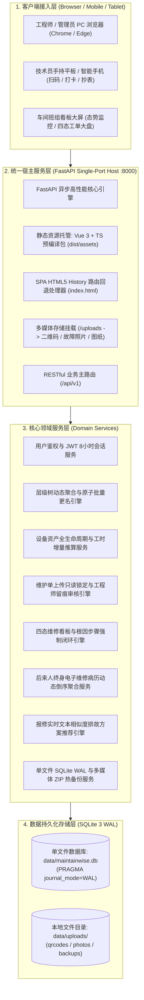
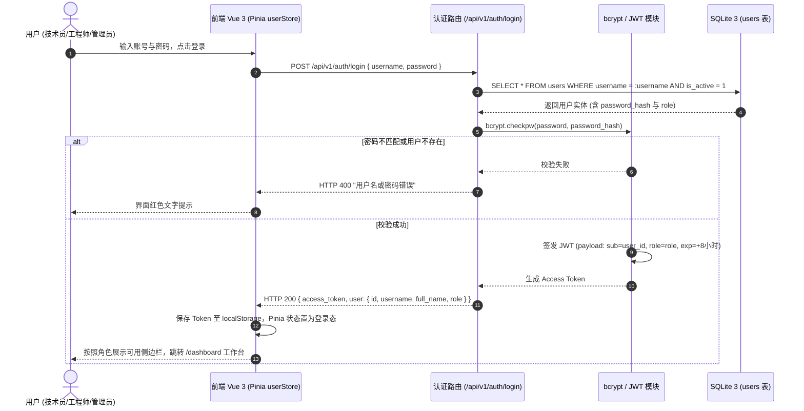
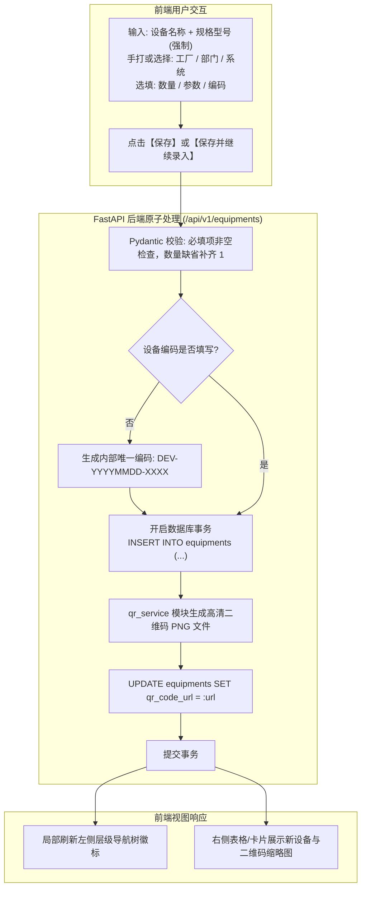
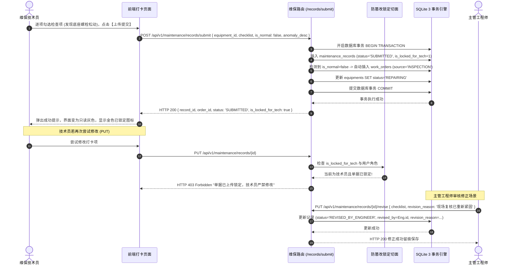
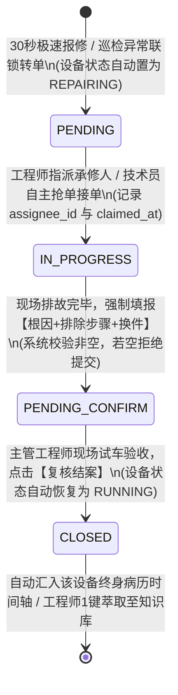
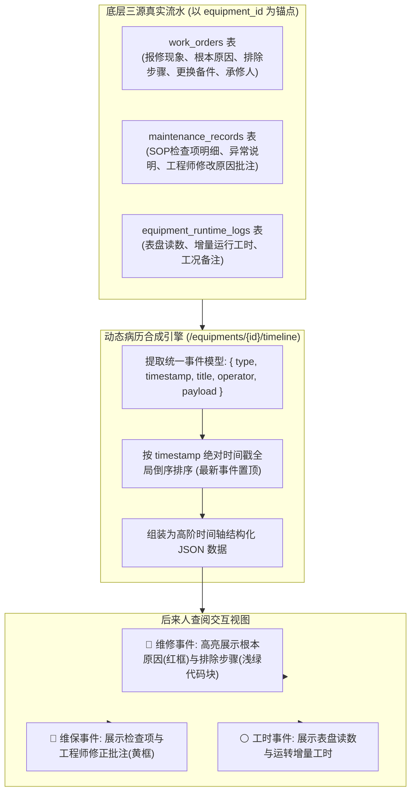
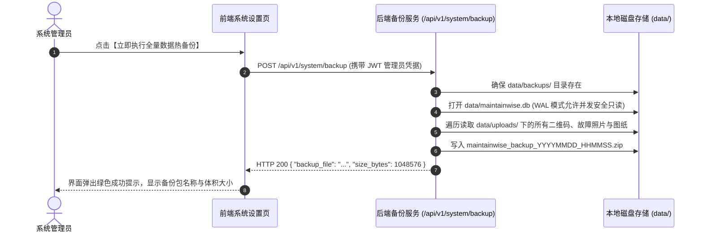
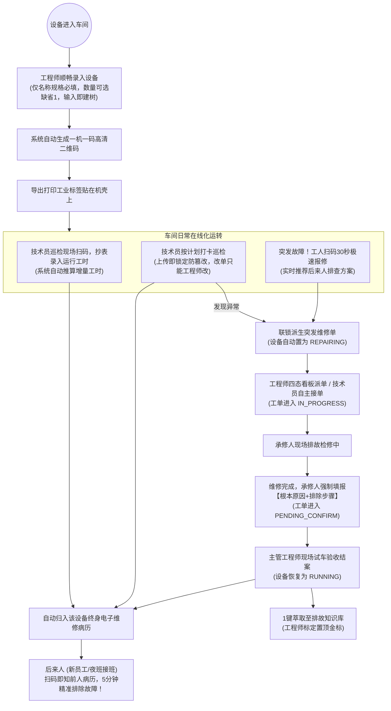

# MaintainWise 2.0 — 智能工厂设备在线化便利系统
# 系统总体设计方案说明书 (System Design Document)

> **文档版本**：V2.0 (按功能章节体系化重构版)  
> **编制日期**：2026-09-15  
> **设计基准**：严格对应《客户需求规格说明书》(CR-*) · 第一性原理驱动 · 零前置卡阻 · 闭环留痕 · 后来人经验传承  
> **目标运行环境**：Windows Server 2016/2019/2022/2025 离线工控机 (开发测试于 Linux)

---

## 目录索引 (Table of Contents)

1. [第一章：系统总体架构与顶层设计哲学](#第一章系统总体架构与顶层设计哲学)
2. [第二章：用户与三角色权限管理模块](#第二章用户与三角色权限管理模块)
3. [第三章：设备资产、层级架构与工时抄表模块](#第三章设备资产层级架构与工时抄表模块)
4. [第四章：设备维护单与日常保养管理模块](#第四章设备维护单与日常保养管理模块)
5. [第五章：突发故障报修与维修工单全流程模块](#第五章突发故障报修与维修工单全流程模块)
6. [第六章：后来人终身维修病历与排故知识库模块](#第六章后来人终身维修病历与排故知识库模块)
7. [第七章：车间工作台大盘与系统运维管理模块](#第七章车间工作台大盘与系统运维管理模块)
8. [第八章：业务协同、全局数据流转与交互全景设计](#第八章业务协同全局数据流转与交互全景设计)
9. [第九章：跨平台 Linux 与 Windows 双轨一键部署架构](#第九章跨平台-linux-与-windows-双轨一键部署架构)

---

## 第一章：系统总体架构与顶层设计哲学

### 1.1 系统设计是什么 (System Design)
* **顶层定位**：
  MaintainWise 2.0 是一套面向离散与流程制造车间一线的轻量级、高可用、单端口全栈式设备在线化便利系统。
* **分层拓扑架构**：
  系统在逻辑上分为四层，但在物理交付上采用**单端口 (:8000) 统一进程托管**：



### 1.2 业务逻辑是什么 (Business Logic)
* **第一性原理核心准则**：
  车间现场维保的本质是：**快速定位机器、如实反映现状、敏捷派单抢修、强制留存经验、赋能后来人员**。
* **业务运转机制**：
  1. 资产通过“工厂-部门-系统”录入并生成“一机一码”；
  2. 现场技术员日常扫码打卡巡检，数据上传瞬间锁定；
  3. 突发故障 30 秒填报，进入四态看板流转；
  4. 承修人排故修好后必须留下根本原因与处理步骤；
  5. 主管工程师现场验收试车结案，恢复设备正常态；
  6. 历史所有打卡、工时、复盘干货汇流为终身维修病历，供后来人扫码秒查。

### 1.3 业务和业务之间的关系 (Inter-business Relations)
* **宿主与各子业务**：单端口宿主为所有业务模块提供统一鉴权会话、统一路由网关和统一静态资源托管；
* **业务串联闭环**：设备资产是业务载体，日常巡检是前置预防，突发工单是纠正动作，电子病历是知识沉淀，大盘看板是宏观态势调度。

### 1.4 数据如何传递 (Data Flow)
* 客户端发起统一 HTTP/HTTPS 请求至 `:8000` 端口；
* 若为 `/api/v1/*` 则由 FastAPI 路由分发至各领域服务；
* 若为 `/uploads/*` 直接流式响应本地多媒体文件；
* 其余所有前端页面路由均命中 SPA Fallback 回退至 `dist/index.html`，由前端 Vue Router 客户端接管。

### 1.5 如何交互 (User Interactions)
* 全局响应式自适应布局：PC 端支持宽屏双模看板与多列表格；移动端/平板端自适应为单列手势卡片与大按键交互，方便现场工人佩戴手套单指触控。

---

## 第二章：用户与三角色权限管理模块

### 2.1 系统设计是什么 (System Design)
* **对应客户需求**：`CR-USR-001`, `CR-USR-002`, `CR-USR-003`, `CR-USR-004`, `CR-USR-005`, `CR-USR-006`。
* **数据实体模型**：
  系统采用单张 `users` 表存储全厂人员，剔除过度设计的用户-角色-权限三张中间表。
  - 表字段：`id` (主键), `username` (唯一工号/账号), `password_hash` (bcrypt 加盐密文), `full_name` (姓名), `employee_no` (唯一工号), `role` (角色枚举: `ADMIN`, `ENGINEER`, `TECHNICIAN`), `phone`, `email`, `is_active` (软删除标志), `must_change_password` (强制改密标志), `password_updated_at` (密码更新时间戳), `is_frozen` (账户超期冻结标志), `created_at`。
* **安全鉴权微核心**：
  - 基于 OAuth2 Password Bearer 颁发标准 JWT Access Token；
  - 密码散列直接采用底层纯 C/预编译 `bcrypt` 原生库（`bcrypt.hashpw` 与 `bcrypt.checkpw`），彻底避免 passlib 与 Python 3.14 的版本兼容性问题；
  - 令牌默认有效时长设定为 **480 分钟（8小时）**，完美匹配车间单班制作业周期；
  - 提供 FastAPI 依赖注入鉴权守卫：`get_current_user`、`require_admin`、`require_engineer`、`require_technician`。
  - **180天生命周期守护器与超期自冻结切面**：
    - 登录请求到达时，系统核对当前系统时间与 `password_updated_at` 的差值 $\Delta D$；
    - 若 $\Delta D > 180$ 天，系统自动将 `is_frozen` 置为 true 并拒绝本次登录，返回 HTTP 403 明确提示；
    - 若 `must_change_password` 为 true（初始密码或管理员重置密码后首次登录），前端实施路由级物理隔离，直接跳转至独立的专属强制改密页面（`/force-change-password`），在成功设定新密码前严格禁止加载或渲染任何车间数据大盘与设备底单，彻底杜绝背景数据泄露；
    - **改密后安全强制退出与重认证机制**：无论是首次强制改密还是日常主动改密，新密码设定成功后前端立即安全销毁当前 Token 与本地凭据（`userStore.logout()`），强制重定向至登录页并要求使用新密码重新登录，达成严格的零信任凭据轮换闭环。

### 2.2 业务逻辑是什么 (Business Logic)
1. **三角色权责绝对硬隔离**：
   - **系统管理员 (ADMIN)**：
     - 独占全厂员工账号的增删改查；
     - 独占任意员工密码一键重置权及冻结账户解冻权；
     - 独占系统参数配置与数据库全量热备份权。
   - **主管工程师 (ENGINEER)**：
     - 业务管理中枢；负责设备台账录入修改、层级重命名与级联清理；
     - 维保计划编制与下发；
     - 突发工单派发、调度与改派；
     - **独占维护单修改权（技术员上传后仅工程师可改）**；
     - 维修工单试车验收结案与设备状态恢复；
     - 排故知识库案例录入、编辑与置顶金标标定。
   - **维保技术员 (TECHNICIAN)**：
     - 一线现场执行者；负责巡检维护单打卡（**上传即锁定只读，自身严禁修改**）；
     - 负责现场表盘运行工时抄表录入；
     - 负责突发故障 30 秒极速报修与工单纠错；
     - 查阅设备终身维修病历与排故知识库。
2. **账号软删除与责任人终身审计**：
   - 人员调离或离职时采用 `is_active = false` 停用账号；
   - 历史维保打卡记录、维修工单中的经办人、承修人外键关联永久完好保留，满足车间质量审计可追溯性。

### 2.3 业务和业务之间的关系 (Inter-business Relations)
* **用户是所有业务记录的法定签署人**：
  - 设备台账关联 `responsible_engineer_id`；
  - 维护单关联 `technician_id` 与 `revised_by_engineer_id`；
  - 工单关联 `reporter_id`、`assigned_by_engineer_id` 与 `assignee_id`；
  - 工时流水关联 `recorded_by`；
* **全局拦截切面**：后续所有功能接口均强制挂载本模块的角色守卫，未授权请求在路由入口即被阻断。

### 2.4 数据如何传递 (Data Flow)



### 2.5 如何交互 (User Interactions)
* **便捷体验切换**：登录界面除了常规输入框外，底部配备“一键切换身份”快捷按钮（管理员 / 工程师 / 技术员），供测试自测或现场演练快速填充；
* **顶部身份指示牌**：系统全局顶部导航栏常驻角色徽标（管理员为红色、工程师为深蓝、技术员为翠绿），并标明当前登录姓名与工号；
* **人员管理操作台 (管理员专属)**：
  - 列表呈现全厂人员、工号、角色、联系电话、启用状态；
  - 操作列提供【编辑资料】、【重置密码】、【停用】按钮；点击“重置密码”弹出模态框直接键入新密码即刻生效。

---

## 第三章：设备资产、层级架构与工时抄表模块

### 3.1 系统设计是什么 (System Design)
* **对应客户需求**：`CR-DEV-001` ~ `CR-DEV-013`。
* **数据实体模型**：
  采用 `equipments` (设备主表)、`custom_hierarchies` (用户自定义组织架构表) 与 `equipment_runtime_logs` (运行工时抄表流水表)。
  - `custom_hierarchies` 字段：`id`, `factory` (工厂名称), `department` (车间部门), `system_name` (产线系统), `created_at`，三元组建立联合唯一索引 `UNIQUE(factory, department, system_name)`；
  - `equipments` 字段：`id`, `factory` (工厂名称), `department` (部门/车间), `system_name` (系统/产线), `equipment_name` (设备名称), `model_spec` (规格型号), `quantity` (数量, 默认1), `parameters` (参数长文本), `equipment_code` (设备编码, 可选), `responsible_engineer_id` (主管工程师ID), `status` (状态枚举: `RUNNING`, `REPAIRING`, `MAINTAINING`, `STOPPED`), `running_mode` (运行模式: `CONTINUOUS` 持续运行 / `INTERMITTENT` 间歇运行), `maintenance_interval_hours` (维护倒计时周期小时), `advance_warning_hours` (提前预警阈值小时, 默认20), `last_maintenance_hours` (上次维保时的累计工时基线), `total_running_hours` (累计工时), `last_runtime_updated_at`, `qr_code_url` (二维码图片路径), `is_deleted`。
  - `equipment_runtime_logs` 字段：`id`, `equipment_id`, `recorded_by` (抄表人ID), `reading_hours` (表盘累计读数), `delta_hours` (推算的本次增量工时), `remark`, `recorded_at`。
* **一机一码服务引擎**：
  轻量 `qrcode` 生成器，新增设备瞬间将包含设备直达 URL 的二维码图片渲染至 `data/uploads/qrcodes/qr_dev_{id}.png`。

### 3.2 业务逻辑是什么 (Business Logic)
1. **工厂-部门-系统三级划分与极致顺畅录入**：
   - 彻底摒弃传统软件“先建工厂树、再建车间树、再录设备”的死板层级设计；
   - 用户打开新增设备弹窗，在工厂, 部门、系统中既可下拉选择已有分类，**也可直接手打输入全新的名称**；保存设备时系统自动根据字符串聚合层级，实现“输入即建树”，零前置卡阻；
   - 弹窗提供【保存并继续录入下一台】快捷按钮，保存成功后自动重置字段并将光标定位于名称输入框，现场录入效率达 10 秒一台。
2. **组织架构前置规划与用户主动创建层级 (CR-DEV-013)**：
   - 支持主管工程师与管理员在未录入具体机器前，预先规划或新建工厂、车间与系统架构；
   - 架构树卡片常驻【+ 创建层级】按钮，支持直接输入全新架构名称，或选择已有组织并在其下快速扩展子级；
   - 树节点悬停配备快捷级联动作（工厂节点 ➕ 快速添加部门，部门节点 ➕ 快速添加系统，系统节点 ➕ 直接打开录入设备弹窗并预填归属）；
   - 双源动态聚合：架构树查询接口 `GET /api/v1/equipments/hierarchy-tree` 自动合并 `equipments` 设备表与 `custom_hierarchies` 架构表，零设备的新建层级正常在树中展现；点击空层级自动引导进入录入流程。
3. **设备字段刚柔兼顾机制**：
   - **强制项**：【设备名称 (`equipment_name`)】与【规格型号 (`model_spec`)】必须填写；
   - **可选项**：
     - 数量 (`quantity`)：整型，默认缺省为 1；
     - 设备参数 (`parameters`)：长文本，记录功率、电压、转速等技术参数，可留空；
     - 设备编码 (`equipment_code`)：非必填。未填写时后台自动生成内部编码 `DEV-YYYYMMDD-随机号`，绝不因编码缺失阻碍现场建档。
4. **现场检索以设备名称为主**：
   - 工人日常称呼机器如“1号空压机”、“引风机电机”，不记编码；
   - 全局搜索栏与移动端检索均将 `equipment_name` 置于第一优先级进行模糊穿透匹配。
5. **工厂/部门/系统层级多次任意重命名与安全级联删除**：
   - 车间拆分、重命名或归并时，系统管理员与主管工程师可随时对层级节点更名；
   - 后端在**单个数据库事务**中执行批量同步更新所有关联设备及 `custom_hierarchies` 的层级字段；
   - 历史所有工单、维护单、工时记录均与设备的不可变 `id` 关联，**层级无论如何更名，历史数据零断层、零丢失**；
   - 支持层级级联软删除：当用户确认关停某层级时，系统自动级联软删除从属的所有设备及其关联未完工单，杜绝孤儿数据。
6. **间歇与持续双模维护预测与 14 天滑动加权算法**：
   - **持续运行模式 (`CONTINUOUS`)**：设备 7x24 小时全天候运转，维护周期换算为连续时钟，倒计时线性衰减；
   - **间歇运行模式 (`INTERMITTENT`)**：工程师根据生产计划每天开机 2~8 小时不等。系统根据设备设定的 `maintenance_interval_hours`（如 100 小时）和当前累计工时差额计算剩余小时数：
     $$\text{Remaining Hours} = \text{maintenance\_interval\_hours} - (\text{total\_running\_hours} - \text{last\_maintenance\_hours})$$
   - **14天滑动加权日均工时预测**：系统自动检索过去 14 天的实际抄表流水，推算近期日均开机时间，预估到期剩余自然日并在界面直观呈现；
   - **自适应预警与打卡闭环**：
     当 $\text{Remaining Hours} \le \text{advance\_warning\_hours}$（默认 20 小时）时，触发黄色临期预警并联动邮件；巡检打卡完成并归档后，系统自动将 `last_maintenance_hours` 更新为当前 `total_running_hours`，倒计时自动重置。
7. **技术员现场运行工时双模录入与增量推算**：
   - 支持技术员在移动端或 PC 端输入“今日运转工时 (`delta_hours`)”或直接输入“当前表盘读数 (`reading_hours`)”；
   - 写入独立流水日志，并原子更新设备总工时 `total_running_hours`。

### 3.3 业务和业务之间的关系 (Inter-business Relations)
* 设备资产是全厂生产的心脏与核心主线；
* 维保计划 `maintenance_plans` 绑定特定设备；
* 维修工单 `work_orders` 针对故障设备报修，并联动改变设备状态（`RUNNING` $\leftrightarrow$ `REPAIRING`）；
* 工时抄表记录累计工时，驱动工时预警；
* 所有业务操作最终流向该设备的**终身维修病历**。

### 3.4 数据如何传递 (Data Flow)



### 3.5 如何交互 (User Interactions)
* **左树右表 / 卡片双模界面**：
  - 左侧层级树清晰列出【全部设备】及工厂 $\rightarrow$ 部门 $\rightarrow$ 系统层级；每个节点标注挂载设备数（如 `空压站 (8)`）；
  - 节点悬停交互：管理员或工程师鼠标悬停在节点上，右侧出现【✏️ 重命名】图标，点击弹出就地修改窗口；
  - 点击左侧任一节点，右侧列表毫秒级过滤呈现；
* **视图双模切换**：
  - **表格列表视图**：显示设备名称（加粗高亮）、规格、数量、累计工时（带快捷【抄表】小按钮）、状态彩色 Tag、操作列；
  - **大卡片看板视图**：适用于现场工业触控一体机，卡片大字展示工时、状态光环与二维码，手指一触即可打开详情。

---

## 第四章：设备维护单与日常保养管理模块

### 4.1 系统设计是什么 (System Design)
* **对应客户需求**：`CR-MNT-001`, `CR-MNT-002`, `CR-MNT-003`, `CR-MNT-004`, `CR-MNT-005`, `CR-MNT-006`。
* **数据实体模型**：
  采用 `maintenance_plans` (保养标准计划表) 与 `maintenance_records` (现场维护打卡记录表)。
  - `maintenance_plans` 字段：`id`, `equipment_id`, `plan_name`, `created_by_engineer_id`, `interval_days` (保养周期天数), `check_items_json` (JSON 格式 SOP 检查项目清单), `last_completed_date`, `next_due_date`, `is_active`。
  - `maintenance_records` 字段：`id`, `record_no` (唯一单号: `MNT-xxx`), `equipment_id`, `plan_id`, `technician_id` (打卡技术员ID), `status` (`DRAFT`, `SUBMITTED`, `REVISED_BY_ENGINEER`), `is_locked_for_tech` (核心锁定标志位, 默认 0), `submitted_at`, `revised_by_engineer_id` (修正工程师ID), `revised_at`, `revision_reason` (工程师修改原因批注), `is_normal` (全项正常标志), `checklist_result_json` (检查结果详情 JSON), `anomaly_desc` (异常情况描述), `interlocked_work_order_id` (联锁派生的维修工单ID)。

### 4.2 业务逻辑是什么 (Business Logic)
1. **工程师下发周期保养计划与动态 SOP 检查项标准**：
   - 彻底摒弃写死静态检查项的弊端，系统支持现场用户与工程师**动态自定义添加/删除检查项目**；
   - 每个检查项包含条目名称与标准判定规范，支持现场打卡单选标记【合格】或【异常】；
   - 提供【工厂-部门-系统-设备】四级级联筛选器，精确定位目标设备，彻底杜绝重名设备混淆。
2. **技术员现场巡检打卡与双模工时闭环**：
   - 技术员根据计划或扫码即兴打卡，界面呈现清单，技术员逐项判定【合格】或【异常】；
   - 若存在异常项，必须填写异常说明文字，支持手机拍照上传附件；
   - 支持在打卡时同步填报今日运行工时（`log_runtime_hours`）；打卡全项合格提交后，系统自动重置设备 `last_maintenance_hours = total_running_hours`，倒计时清零步入下一维护周期。
3. **“上传即锁定只读”核心防篡改机制（工业管理铁律）**：
   - 技术员在检查确认完毕点击【上传提交】瞬间，系统将单据状态置为 `SUBMITTED`，并将 `is_locked_for_tech` 置为 `true`；
   - **界面层阻断**：前端立即移除技术员界面的“编辑”、“修改”、“删除”按钮，仅保留“查看”；
   - **接口层阻断**：若技术员绕过前端直接调用 API 修改单据，后端安全切面校验到 `is_locked_for_tech == true` 且当前操作人为技术员时，**强行阻断并抛出 HTTP 403 Forbidden**，确保巡检打卡数据的严肃性与防作弊。
4. **主管工程师独占修改权与强制留痕批注**：
   - 若现场确实因网络重发误录、数据偏差需要更正，**修改权限仅归属主管工程师**；
   - 工程师调用修正接口时，系统强制要求必须填写【修改原因与复核批注 (`revision_reason`)】；
   - 单据状态变更为 `REVISED_BY_ENGINEER`，完整记录修改工程师、修改时间与修改原因，终身可追溯。
5. **巡检异常联锁事务自动派单**：
   - 技术员打卡若标记 `is_normal == false`（发现设备隐患）；
   - 系统在**同一底层数据库事务**中自动派生创建一张来源为 `INSPECTION` 的突发维修工单，并将设备状态跃迁至 `REPAIRING`，实现隐患即刻转抢修闭环。

### 4.3 业务和业务之间的关系 (Inter-business Relations)
* 维护单由保养计划派生；
* 维护单提交后反向推算更新计划的 `last_completed_date` 与 `next_due_date`；
* 维护单异常联锁生成维修工单，改变设备状态；
* 维护单的全部打卡结果与工程师修正批注完整归入终身病历时间轴。

### 4.4 数据如何传递 (Data Flow)



### 4.5 如何交互 (User Interactions)
* **维护单列表卡片**：
  - 列表清晰展示单号、关联设备名称、打卡人、提交时间、结论徽章（绿标“全项正常” / 红标“存在异常”）；
  - 锁定标志：已提交单据右侧带有醒目的金色小锁 🔒 徽标；
  - 操作权限差异化渲染：技术员视角仅提供【查看明细】；工程师视角提供黄色【✏️ 审核修正】按钮；
* **工程师修正窗口**：
  - 顶部醒目黄色提示：“主管工程师独占审核权限：修正现场打卡单必须填写修改理由”；
  - 界面提供修改项与强制必填的“修改理由与批注”，未填写理由时保存按钮处于禁用状态。

---

## 第五章：突发故障报修与维修工单全流程模块

### 5.1 系统设计是什么 (System Design)
* **对应客户需求**：`CR-WO-001`, `CR-WO-002`, `CR-WO-003`, `CR-WO-004`, `CR-WO-005`, `CR-WO-006`。
* **数据实体模型**：
  采用 `work_orders` (维修工单全流程表)。
  - 表字段：`id`, `order_no` (唯一单号: `WO-YYYYMMDD-XXXX`), `equipment_id`, `source` (`MANUAL` 极速手工报修 / `INSPECTION` 巡检异常转单), `title` (故障简述), `phenomenon` (详细现象), `urgency` (紧急度: `NORMAL`, `MAJOR`, `CRITICAL`), `fault_photo_path`, `reporter_id` (报修人ID), `reported_at`, `status` (四态流转: `PENDING`, `IN_PROGRESS`, `PENDING_CONFIRM`, `CLOSED`), `assigned_by_engineer_id` (派工工程师ID), `assignee_id` (承修人ID), `claimed_at`, `root_cause` (根本原因), `solution_steps` (排除步骤), `spare_parts` (更换备件规格数量), `repair_duration_minutes` (维修耗时), `completed_at`, `is_featured_case` (典型案例标定)。

### 5.2 业务逻辑是什么 (Business Logic)
1. **全员 30 秒极速突发报修**：
   - 彻底剥离传统繁琐表单，车间任何人员只需 3 步：选设备 $\rightarrow$ 填一句话简述 $\rightarrow$ 选紧急程度，即可提交；
   - 提交后系统立即自动将该设备状态置为 `REPAIRING`（故障中），工单状态置为 `PENDING`。
2. **极简四态流转状态机与草稿纠错机制**：
   - `PENDING` (待派单)：新报修待调度；**支持创建人或工程师点击【编辑】修改纠错**（修正手误或补充现场描述）；
   - `IN_PROGRESS` (排故维修中)：已由工程师指派专人，或技术员自主抢单认领，进入抢修；
   - `PENDING_CONFIRM` (完工待验收)：现场排故完成，承修人提交复盘报告。**卡片支持点击弹出完整详情对话框**，供主管工程师试车前穿透查验承修人填写的根本原因、排除步骤、用件及照片；
   - `CLOSED` (已闭环归档)：工程师试车平稳复核结案，**设备主表状态自动恢复为 `RUNNING` 正常运行**。
3. **已闭环工单典型案例标定机制 (`is_featured_case`)**：
   - 工单结案归档后，若工程师复盘认为该排故案例具备典型价值，可点击【标定典型案例】；
   - 系统将案例打上置顶金标，自动沉淀至“后来人知识库”，作为全厂经典排故教科书。
4. **工程师派单与技术员抢单双轨调度**：
   - 支持工程师根据技术专长在看板上一键指定责任人；同时也支持当班技术员在看板上点击【自主接单】快速抢修。
5. **维修复盘根本原因与步骤强制闭环（核心传承资产）**：
   - 严禁“形式主义结案”！承修人提交完工报告时，系统必须强制填报两项核心内容：
     - **【故障根本原因 (`root_cause`)】**：强制非空（如“变频器散热风道积尘短路导致过流跳闸”）；
     - **【详细排除步骤 (`solution_steps`)】**：强制非空（详细记录拆解、测试、吹扫、换件与参数重置步骤）；
   - 未填报上述两项内容时，系统接口级拒绝提交完工。

### 5.3 业务和业务之间的关系 (Inter-business Relations)
* 工单创建联动改变设备运行状态为 `REPAIRING`；
* 工单结案联动恢复设备运行状态为 `RUNNING`；
* 工单完工填报的根因与步骤作为核心要素沉淀至**终身维修病历**；
* 优质典型工单一键反哺至**排故知识库**。

### 5.4 数据如何传递 (Data Flow)



### 5.5 如何交互 (User Interactions)
* **四态可视化看板**：
  - 界面按 `🔴 待派单`、`🔵 排故维修中`、`🟡 完工待验收`、`🟢 已闭环归档` 分为 4 栏泳道；
  - 工单卡片显示单号、设备名称、紧急度红黄徽章、报修人、承修人与用时；
  - 泳道操作按钮按角色动态适配：待派单栏工程师显示“派工”，技术员显示“自主接单”；待验收栏仅工程师显示“试车结案”；已闭环栏工程师显示“⭐ 萃取知识库”。

---

## 第六章：后来人终身维修病历与排故知识库模块

### 6.1 系统设计是什么 (System Design)
* **对应客户需求**：`CR-KB-001`, `CR-KB-002`, `CR-KB-003`。
* **数据实体模型**：
  采用 `knowledge_cases` (排故知识库案例表) 与设备终身病历动态聚合服务。
  - `knowledge_cases` 字段：`id`, `source_order_id` (来源工单ID), `title` (案例标题), `equipment_category` (设备大类: 电机/风机/泵阀/PLC/变频器等), `phenomenon` (典型现象), `root_cause` (根本原因深度剖析), `solution_steps` (标准排除指导步骤), `tags` (标签), `is_featured` (置顶金标, 1=是, 0=否), `created_by_engineer_id`, `updated_at`。
* **病历动态聚合引擎 (`/api/v1/equipments/{id}/timeline`)**：
  基于设备不可变主键 ID，动态跨表联合查询该设备的历史维修工单、维保打卡记录与运行工时抄表流水，按事件时间戳进行毫秒级倒序归并。

### 6.2 业务逻辑是什么 (Business Logic)
1. **后来人第一性原理——终身电子维修病历时间轴**：
   - 工业设备故障多具有历史复发性与规律性；
   - 彻底解决新员工或夜班接班人员在深夜面对停机故障时不知所措的痛点；
   - 系统将该设备一生经历的所有**维修工单（含根因与步骤）**、**维保记录（含工程师修改批注）**、**工时抄表（含增量运行时间）**三流合一；
   - 后来人扫码直达，一眼看清该设备历史故障树与前人排查方案，5 分钟理清排障思路。
2. **结案工单一键萃取沉淀至知识库**：
   - 对于通用性强、具有典型教学意义的排故工单，工程师在结案后一键点击【萃取至知识库】；
   - 系统自动提取现象、根因、步骤生成通用指南，供全厂技术员随时调阅学习。
3. **报修输入实时智能排故联想**：
   - 工人在报修输入“电机震动大”或“变频器报OC”时；
   - 系统后台根据关键词实时匹配知识库，前台即时浮现历史成功排除方案，实现“尚未发单，排查指南已先送达现场”。

### 6.3 业务和业务之间的关系 (Inter-business Relations)
* **病历是业务事实的被动沉淀**：设备日常的所有动作自动在病历中刻下时间痕迹，无需工人做二次录入报表；
* **知识库是业务智慧的主动提炼**：将分散在一台机器上的排故经验，升级为指导全厂同类机器的 SOP。

### 6.4 数据如何传递 (Data Flow)



### 6.5 如何交互 (User Interactions)
* **终身电子维修病历抽屉**：
  - 设备台账右侧点击【📋 终身病历档案】，右侧滑出全屏抽屉；
  - 顶部显示设备三级层级、当前总工时与健康度；下方呈现精美时间轴；
  - 维修卡片高亮排版：故障现象、根本原因用醒目浅红底纹加粗呈现，排查步骤按编号有序排列，更换备件与维修耗时一目了然；
* **知识库案例库**：
  - 顶部居中大搜索框，支持回车全文秒搜；支持按分类（变频器/电机/风机等）及“置顶金标”一键筛选。

---

## 第七章：车间工作台大盘与系统运维管理模块

### 7.1 系统设计是什么 (System Design)
* **对应客户需求**：`CR-SYS-001`, `CR-SYS-002`, `CR-SYS-003`, `CR-SYS-004`, `CR-SYS-005`。
* **数据实体模型**：
  采用 `system_settings` 表存储系统全局定制参数：`factory_name` (系统大标题定制), `smtp_host`, `smtp_port`, `smtp_user`, `smtp_pass`, `smtp_sender`, `smtp_recipients`, `smtp_enabled`, `notify_lead_days`。
* **SQLite WAL 纯内存流式热备份引擎**：
  利用纯 Python 内置 `zipfile` 模块，在线直接读取 `data/maintainwise.db` 与 `data/uploads/` 目录，流式压缩打包生成标准 ZIP 归档包。
* **在线文档与帮助中心服务引擎 (`/docs`)**：
  - 后端提供安全白名单读取引擎（`backend/app/api/v1/endpoints/docs.py`），对系统根目录下的 `docs/` 目录中的 6 份工程技术规范建立轻量缓存与实时流式读取；
  - 前端独立路由视图 `DocsReaderView.vue` 搭配 `marked` 解析器，支持全平台离线实时渲染。

### 7.2 业务逻辑是什么 (Business Logic)
1. **全厂资产与工单态势大盘**：
   - 首页大屏实时显示全厂设备健康态势：正常运行台数（绿）、故障检修台数（红）、待保养台数（黄）、停机台数（灰）；
   - 支持点击任意数字卡片，一键钻取过滤出对应状态的设备清单。
2. **角色差异化智能待办机制**：
   - 消除传统系统所有待办混杂堆积的痛点：
     - **技术员**：展示指派给自己的进行中抢修任务，以及即将到期的维保打卡任务；
     - **工程师**：展示新报修待派单、技术员修完待现场复核验收的工单，以及超期保养报警；
     - **管理员**：展示全厂账号活跃度与数据备份状态。
3. **单文件 SQLite 3 WAL 离线数据一键热备份**：
   - 彻底解决车间离线 Windows Server 无 DBA、无备份工具的难题；
   - 管理员点击【立即执行热备份】，系统免停机在线将数据库和多媒体文件打包为带时间戳的标准 ZIP（保存在 `data/backups/`）；
   - 服务器灾难损坏时，直接解压 ZIP 覆盖即可在 1 分钟内完美恢复全量系统！
4. **SMTP 邮件告警调度引擎**：
   - 管理员在系统设置中配置局域网或公网 SMTP 邮件服务器，支持【发送测试邮件】连通性自测；
   - 当设备工时倒计时触发提前预警阈值（$\text{Remaining Hours} \le \text{advance\_warning\_hours}$）或突发重特大故障报修时，系统后台通过线程池异步调度投递告警邮件，防漏保防滞后。
5. **系统设计文档与帮助中心在线浏览 (`/docs`)**：
   - 将系统全部 6 份设计与部署文档在线化、无纸化嵌入系统内部；
   - 任何用户登录后均可通过左侧侧边栏【设计文档与帮助】或顶部右上角【📖 帮助文档】直达；
   - 支持按“需求规范”、“架构设计”、“部署运维”分类过滤，提供全局关键字实时过滤、Markdown 高精度渲染、目录树折叠、大纲标题精准平滑跳转及打印导出。

### 7.3 业务和业务之间的关系 (Inter-business Relations)
* 工作台大盘是全厂各业务模块指标的“神经中枢”与汇总出口；
* 系统运维热备份为全厂所有数据资产筑牢安全底座。

### 7.4 数据如何传递 (Data Flow)



### 7.5 如何交互 (User Interactions)
* 首页工作台提供醒目的大数字看板卡片，左侧呈现“我的专属待办”，带红黄紧急度 Tag，点击单据直达处理界面；
* 设置页面提供一键热备按钮与系统定制大标题即时修改预览。

---

## 第八章：业务协同、全局数据流转与交互全景设计

### 8.1 业务间协同全景对照矩阵
| 主导业务模块 | 协作业务模块 | 协同触发点 | 数据传递形式 | 最终业务价值 |
| :--- | :--- | :--- | :--- | :--- |
| **设备资产** | **日常维保** | 工程师录入设备台账 | 传递不可变 `equipment_id`，编制专属保养标准与检查 SOP | 预防性维护启动 |
| **日常维保** | **突发工单** | 技术员打卡发现异常项 | 单事务原子操作：派生创建 `work_orders` 记录，回填关联单号 | 隐患不漏网，自动转派工 |
| **突发工单** | **设备资产** | 极速报修 / 工程师验收 | 状态机联动：报修置 `REPAIRING`，验收恢复 `RUNNING` | 设备在线运行状态实时保真 |
| **维保+工单+工时** | **终身病历** | 现场打卡、完工复盘、日常抄表 | 自动提取事件要素，倒序存入病历时间轴 | 后来人排故查阅无需重复摸索 |
| **突发工单** | **排故知识库** | 工程师现场试车验收通过 | 1键将工单的根因与方案萃取至通用知识库并打上金标 | 车间核心排故技术资产传承 |
| **排故知识库** | **突发报修** | 工人输入报修故障简述 | 前端 300ms 智能防抖联想，即时弹出历史最佳排查卡片 | 报修瞬间获得排查指导 |

### 8.2 全局交互流转架构全景图



---

## 第九章：跨平台 Linux 与 Windows 双轨一键部署架构

### 9.1 跨平台工程约束与技术方案裁决
* **对应客户需求**：`CR-CON-001` ~ `CR-CON-006`。
* **关键裁决与落地措施**：
  1. **Windows 生产端零 Node.js / 零 Webpack 依赖**：前端所有 Vue 3、TypeScript、Element Plus 代码在 Linux 环境一次性构建打包为静态资源（`frontend/dist`），由 FastAPI 单端口统一宿主托管；
  2. **零 C/C++ 本地编译依赖**：Python 依赖选用纯 Python 或官方预编译 Wheel，彻底避免在 Windows 上安装时报 Visual C++ 缺失错误；
  3. **单文件 SQLite 3 WAL 架构**：零配置、零外部数据库服务安装，单文件拷贝即完整迁移；
  4. **路径中立性**：Python 代码全面使用 `pathlib.Path`，杜绝 Linux `/` 与 Windows `\` 路径分隔符差异；
  5. **Windows 批处理防乱码**：所有 Windows `.bat` 脚本强制采用 **CRLF 换行**，首行声明 **`chcp 65001 >nul` (UTF-8)**，确保中文显示完全正常；
  6. **Linux 后台持久守护 (setsid + 会话脱离)**：针对轻量容器或非 systemd 宿主，系统启动采用 `setsid` 独立会话与标准输入脱离机制，SIGHUP 免疫，用户关闭终端或断开 SSH 后台服务 100% 持续稳定运行；
  7. **统一命令行总控架构 (Unified CLI)**：根目录收敛为唯一的统一总控脚本 `maintainwise.sh` (Linux) 与 `maintainwise.bat` (Windows)，支持 `deploy/start/stop/restart/status/logs/backup` 参数化指令，彻底根除根目录散乱脚本。

### 9.2 双轨部署脚本目录树
```
MaintainWise_V2/
├── maintainwise.sh                  # 根目录 Linux 统一总控入口 (./mw.sh 极简别名)
├── maintainwise.bat                 # 根目录 Windows 统一总控入口 (mw.bat 极简别名)
│
├── deploy/                          # 统一双轨部署工具总目录
│   ├── linux/                       # Linux 专用一键运维脚本工具箱
│   │   ├── 0_deploy_all.sh          # 全自动环境校验、依赖安装与服务配置向导 (默认后台启动)
│   │   ├── 1_init_env.sh            # 虚拟环境创建与 SQLite 数据表种子注入
│   │   ├── 2_start_foreground.sh    # 单端口 8000 前台交互测试启动
│   │   ├── start_background.sh     # setsid 独立会话后台守护启动 (免疫 SIGHUP)
│   │   ├── stop_background.sh      # 安全终止后台进程与清理 PID
│   │   ├── status.sh                # 状态诊断与实时日志探针
│   │   ├── restart_background.sh   # 守护重启脚本
│   │   ├── 3_install_service.sh     # 自动生成并注册 systemd 系统守护服务
│   │   ├── 4_start_service.sh       # 启动 Linux Systemd 服务
│   │   ├── 5_stop_service.sh        # 停止 Linux Systemd 服务
│   │   ├── 6_uninstall_service.sh   # 卸载 systemd 服务 (数据完好保留)
│   │   └── 7_backup_now.sh          # 一键打包 SQLite+附件为带时间戳 ZIP
│   │   └── README_LINUX.txt         # Linux 简明部署说明书
│   │
│   └── windows/                     # Windows Server 专用批处理工具箱 (全部 CRLF + UTF-8)
│       ├── 0_deploy_all.bat         # 全自动综合部署向导
│       ├── 1_init_env.bat           # 校验 Python、pip 装包、初始化数据库
│       ├── 2_start_foreground.bat   # 单端口 8000 前台控制台启动
│       ├── 3_install_service.bat    # WinSW 包装注册 Windows 后台自启服务
│       ├── 4_start_service.bat      # 启动 Windows 后台服务 (net start)
│       ├── 5_stop_service.bat       # 停止 Windows 后台服务 (net stop)
│       ├── 6_uninstall_service.bat  # 卸载 Windows 服务
│       ├── 7_backup_now.bat         # 一键打包生成热备 ZIP 归档包
│       ├── winsw.xml                # WinSW 服务包装核心配置文件
│       └── README_WINDOWS.txt       # Windows Server 现场交付说明书
```

---

## 结语：设计质量承诺

本系统方案严格贯彻第一性原理，完全覆盖《客户需求规格说明书》全部 36 条需求。各功能章节清晰解答了系统设计、业务逻辑、业务间关系、数据传递和用户交互五大核心问题，为后续系统设计需求的导出与工程落地提供了权威、完备的技术依据。
