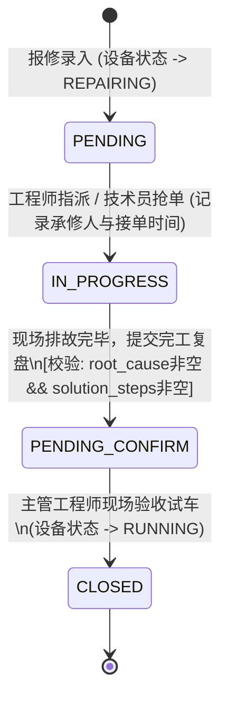

# MaintainWise 2.0 — 智能工厂设备在线化便利系统
# 软件设计文档 (Software Design Document, SWDD)

> **文档版本**：V2.0 (系统工程标准设计版)  
> **编制日期**：2026-09-15  
> **上游输入**：《系统总体设计方案说明书》(2.0) 与《系统设计需求规格说明书》(SDR-*)  
> **核心原则**：高内聚低耦合 · 单端口轻量交付 · 状态机强约束 · 跨平台零编译依赖

---

## 目录索引 (Table of Contents)

1. [第一部分：软件系统架构总览](#第一部分软件系统架构总览)
2. [第二部分：数据库物理存储模型设计 (DDL)](#第二部分数据库物理存储模型设计-ddl)
3. [第三部分：后端服务分层与核心模块设计](#第三部分后端服务分层与核心模块设计)
4. [第四部分：前端组件分层与状态机设计](#第四部分前端组件分层与状态机设计)
5. [第五部分：核心 RESTful API 接口契约规范](#第五部分核心-restful-api-接口契约规范)
6. [第六部分：关键算法与业务状态机流转设计](#第六部分关键算法与业务状态机流转设计)
7. [第七部分：跨平台宿主与常驻服务封装设计](#第七部分跨平台宿主与常驻服务封装设计)

---

## 第一部分：软件系统架构总览

### 1.1 工程物理代码目录拓扑
MaintainWise 2.0 软件代码库采用前后端分离同构工程结构，物理托管于单个运行时环境：

```
MaintainWise_V2/
├── backend/                         # 后端 Python/FastAPI 异步微核心
│   ├── app/
│   │   ├── api/v1/                  # RESTful API 端点控制器
│   │   │   ├── endpoints/
│   │   │   │   ├── auth.py          # 登录认证与 Token 颁发
│   │   │   │   ├── users.py         # 用户增删改查与密码重置
│   │   │   │   ├── equipments.py    # 设备台账、层级更名、工时抄表
│   │   │   │   ├── maintenance.py   # 维保计划、技术员打卡与锁定、工程师修正
│   │   │   │   ├── work_orders.py   # 30秒报修、四态看板流转、复盘结案
│   │   │   │   ├── knowledge.py     # 知识库案例检索、录入与智能推荐
│   │   │   │   └── system.py        # 大盘统计、定制参数与一键热备份
│   │   │   └── router.py            # API 总路由分发
│   │   ├── core/                    # 核心切面与安全配置
│   │   │   ├── config.py            # Pydantic Settings 环境配置
│   │   │   ├── security.py          # 原生 bcrypt 密码散列与 JWT 编解码
│   │   │   └── deps.py              # 数据库连接与三角色 RBAC 依赖注入
│   │   ├── db/                      # 数据持久化底层
│   │   │   ├── session.py           # SQLite 连接上下文与 WAL 模式注入
│   │   │   └── init_db.py           # 表结构自动初始化与演示数据种子
│   │   ├── schemas/                 # Pydantic 请求/响应数据校验模式
│   │   │   ├── user.py              # 用户模型
│   │   │   ├── equipment.py         # 设备与工时模型
│   │   │   ├── maintenance.py       # 维保单与计划模型
│   │   │   ├── work_order.py        # 维修工单全流程模型
│   │   │   ├── knowledge.py         # 知识库与排故推荐模型
│   │   │   └── system.py            # 系统设置与大盘统计模型
│   │   ├── services/                # 领域核心独立服务
│   │   │   ├── qr_service.py        # 一机一码高清二维码生成服务
│   │   │   ├── timeline_service.py  # 后来人终身病历动态倒序聚合引擎
│   │   │   ├── recommend_service.py # 报修实时文本排故推荐算法服务
│   │   │   └── backup_service.py    # SQLite WAL 纯内存 ZIP 热备份服务
│   │   └── main.py                  # FastAPI 单端口总宿主与 SPA 挂载
│   ├── tests/                       # 自动化测试用例套件
│   │   └── test_backend_api.py      # 端到端 API 集成自动化测试 (Pytest)
│   └── requirements.txt             # 生产端纯 Wheel 依赖清单
│
├── frontend/                        # 前端 Vue 3 + TypeScript 源码
│   ├── src/
│   │   ├── api/                     # Axios 封装接口客户端
│   │   ├── components/              # 业务复用高阶组件
│   │   │   ├── EquipmentTimelineDrawer.vue  # 终身维修病历抽屉
│   │   │   ├── HierarchyTree.vue            # 工厂部门系统层级树
│   │   │   └── RecommendationCard.vue       # 报修排故推荐卡片
│   │   ├── router/                  # Vue Router 路由守卫与动态菜单
│   │   ├── stores/                  # Pinia 响应式状态管理 (user, app)
│   │   └── views/                   # 业务功能视图页面
│   │       ├── login/               # 登录视图
│   │       ├── auth/                # 首次登录强制改密独立安全视图 (ForceChangePasswordView)
│   │       ├── dashboard/           # 车间工作台大盘 (数据平台)
│   │       ├── equipments/          # 设备资产与层级管理视图
│   │       ├── maintenance/         # 维保打卡与保养计划视图
│   │       ├── workorders/          # 四态工单流转看板视图
│   │       ├── knowledge/           # 后来人排故知识库视图
│   │       ├── users/               # 人员管理视图 (管理员专属)
│   │       └── settings/            # 系统设置与热备份视图
│   └── dist/                        # 预编译静态前端产物 (直接供 FastAPI 静态托管)
│
├── data/                            # 单机持久化存储目录
│   ├── maintainwise.db              # SQLite 3 WAL 单文件数据库
│   ├── uploads/                     # 多媒体静态资源 (二维码/照片/图纸)
│   └── backups/                     # 一键热备份生成的历史 ZIP 归档目录
│
└── deploy/                          # 双轨一键部署脚本工具箱 (Linux + Windows)
```

### 1.2 单端口统一宿主设计
在生产环境下，系统对外仅监听 TCP `8000` 端口。FastAPI 实例通过中间件及静态挂载实现“三合一”统一交付：
1. `/api/v1/*`：分发至 RESTful API 异步控制器；
2. `/uploads/*`：映射至 `data/uploads/` 本地多媒体文件流；
3. `/*`：通配挂载 `frontend/dist/` 预编译静态资源，未匹配的页面统一返回 `index.html`，由 Vue Router HTML5 History 模式完全接管。

---

## 第二部分：数据库物理存储模型设计 (DDL)

系统采用单文件 SQLite 3 数据库，连接建立时强制启用 WAL 模式与外键约束：
```sql
PRAGMA journal_mode = WAL;
PRAGMA foreign_keys = ON;
PRAGMA synchronous = NORMAL;
```

### 2.1 用户表 (`users`)
```sql
CREATE TABLE IF NOT EXISTS users (
    id INTEGER PRIMARY KEY AUTOINCREMENT,
    username VARCHAR(64) NOT NULL UNIQUE,
    password_hash VARCHAR(255) NOT NULL,
    full_name VARCHAR(64) NOT NULL,
    employee_no VARCHAR(32) NOT NULL UNIQUE,
    role VARCHAR(16) NOT NULL CHECK(role IN ('ADMIN', 'ENGINEER', 'TECHNICIAN')),
    phone VARCHAR(32),
    email VARCHAR(64),
    is_active BOOLEAN NOT NULL DEFAULT 1,
    must_change_password BOOLEAN NOT NULL DEFAULT 0,
    password_updated_at TIMESTAMP DEFAULT CURRENT_TIMESTAMP,
    is_frozen BOOLEAN NOT NULL DEFAULT 0,
    created_at TIMESTAMP DEFAULT CURRENT_TIMESTAMP
);
CREATE INDEX IF NOT EXISTS idx_users_role ON users(role);
CREATE INDEX IF NOT EXISTS idx_users_username ON users(username);
```

### 2.2 设备主表 (`equipments`)
```sql
CREATE TABLE IF NOT EXISTS equipments (
    id INTEGER PRIMARY KEY AUTOINCREMENT,
    factory VARCHAR(128) NOT NULL,
    department VARCHAR(128) NOT NULL,
    system_name VARCHAR(128) NOT NULL,
    equipment_name VARCHAR(128) NOT NULL,
    model_spec VARCHAR(128) NOT NULL,
    quantity INTEGER NOT NULL DEFAULT 1,
    parameters TEXT DEFAULT '',
    equipment_code VARCHAR(64) UNIQUE,
    responsible_engineer_id INTEGER REFERENCES users(id),
    status VARCHAR(16) NOT NULL DEFAULT 'RUNNING' CHECK(status IN ('RUNNING', 'REPAIRING', 'MAINTAINING', 'STOPPED')),
    running_mode VARCHAR(20) NOT NULL DEFAULT 'CONTINUOUS' CHECK(running_mode IN ('CONTINUOUS', 'INTERMITTENT')),
    maintenance_interval_hours REAL NOT NULL DEFAULT 720.0,
    advance_warning_hours REAL NOT NULL DEFAULT 20.0,
    last_maintenance_hours REAL NOT NULL DEFAULT 0.0,
    total_running_hours REAL NOT NULL DEFAULT 0.0,
    last_runtime_updated_at TIMESTAMP,
    qr_code_url VARCHAR(255),
    is_deleted BOOLEAN NOT NULL DEFAULT 0,
    created_at TIMESTAMP DEFAULT CURRENT_TIMESTAMP,
    updated_at TIMESTAMP DEFAULT CURRENT_TIMESTAMP
);
CREATE INDEX IF NOT EXISTS idx_equipments_name ON equipments(equipment_name);
CREATE INDEX IF NOT EXISTS idx_equipments_hierarchy ON equipments(factory, department, system_name);
CREATE INDEX IF NOT EXISTS idx_equipments_status ON equipments(status);
CREATE INDEX IF NOT EXISTS idx_equipments_mode ON equipments(running_mode);
```

### 2.3 设备运行工时流水表 (`equipment_runtime_logs`)
```sql
CREATE TABLE IF NOT EXISTS equipment_runtime_logs (
    id INTEGER PRIMARY KEY AUTOINCREMENT,
    equipment_id INTEGER NOT NULL REFERENCES equipments(id) ON DELETE CASCADE,
    recorded_by INTEGER NOT NULL REFERENCES users(id),
    reading_hours REAL NOT NULL,
    delta_hours REAL NOT NULL,
    remark TEXT DEFAULT '',
    recorded_at TIMESTAMP DEFAULT CURRENT_TIMESTAMP
);
CREATE INDEX IF NOT EXISTS idx_runtime_eq_id ON equipment_runtime_logs(equipment_id);
CREATE INDEX IF NOT EXISTS idx_runtime_date ON equipment_runtime_logs(recorded_at);
```

### 2.4 设备保养计划表 (`maintenance_plans`)
```sql
CREATE TABLE IF NOT EXISTS maintenance_plans (
    id INTEGER PRIMARY KEY AUTOINCREMENT,
    equipment_id INTEGER NOT NULL REFERENCES equipments(id) ON DELETE CASCADE,
    plan_name VARCHAR(128) NOT NULL,
    created_by_engineer_id INTEGER NOT NULL REFERENCES users(id),
    interval_days INTEGER NOT NULL DEFAULT 30,
    check_items_json TEXT NOT NULL,
    last_completed_date DATE,
    next_due_date DATE,
    is_active BOOLEAN NOT NULL DEFAULT 1,
    created_at TIMESTAMP DEFAULT CURRENT_TIMESTAMP
);
CREATE INDEX IF NOT EXISTS idx_mplan_next_due ON maintenance_plans(next_due_date);
```

### 2.5 现场维护打卡记录表 (`maintenance_records`)
```sql
CREATE TABLE IF NOT EXISTS maintenance_records (
    id INTEGER PRIMARY KEY AUTOINCREMENT,
    record_no VARCHAR(64) NOT NULL UNIQUE,
    equipment_id INTEGER NOT NULL REFERENCES equipments(id) ON DELETE CASCADE,
    plan_id INTEGER REFERENCES maintenance_plans(id),
    technician_id INTEGER NOT NULL REFERENCES users(id),
    status VARCHAR(32) NOT NULL DEFAULT 'DRAFT' CHECK(status IN ('DRAFT', 'SUBMITTED', 'REVISED_BY_ENGINEER')),
    is_locked_for_tech BOOLEAN NOT NULL DEFAULT 0,
    submitted_at TIMESTAMP,
    revised_by_engineer_id INTEGER REFERENCES users(id),
    revised_at TIMESTAMP,
    revision_reason TEXT DEFAULT '',
    is_normal BOOLEAN NOT NULL DEFAULT 1,
    checklist_result_json TEXT NOT NULL,
    anomaly_desc TEXT DEFAULT '',
    interlocked_work_order_id INTEGER REFERENCES work_orders(id),
    created_at TIMESTAMP DEFAULT CURRENT_TIMESTAMP
);
CREATE INDEX IF NOT EXISTS idx_mrecord_eq ON maintenance_records(equipment_id);
CREATE INDEX IF NOT EXISTS idx_mrecord_lock ON maintenance_records(is_locked_for_tech);
```

### 2.6 维修工单全流程表 (`work_orders`)
```sql
CREATE TABLE IF NOT EXISTS work_orders (
    id INTEGER PRIMARY KEY AUTOINCREMENT,
    order_no VARCHAR(64) NOT NULL UNIQUE,
    equipment_id INTEGER NOT NULL REFERENCES equipments(id) ON DELETE CASCADE,
    source VARCHAR(16) NOT NULL DEFAULT 'MANUAL' CHECK(source IN ('MANUAL', 'INSPECTION')),
    title VARCHAR(128) NOT NULL,
    phenomenon TEXT DEFAULT '',
    urgency VARCHAR(16) NOT NULL DEFAULT 'NORMAL' CHECK(urgency IN ('NORMAL', 'MAJOR', 'CRITICAL')),
    fault_photo_path VARCHAR(255),
    reporter_id INTEGER NOT NULL REFERENCES users(id),
    reported_at TIMESTAMP DEFAULT CURRENT_TIMESTAMP,
    status VARCHAR(32) NOT NULL DEFAULT 'PENDING' CHECK(status IN ('PENDING', 'IN_PROGRESS', 'PENDING_CONFIRM', 'CLOSED')),
    assigned_by_engineer_id INTEGER REFERENCES users(id),
    assignee_id INTEGER REFERENCES users(id),
    claimed_at TIMESTAMP,
    root_cause TEXT DEFAULT '',
    solution_steps TEXT DEFAULT '',
    spare_parts TEXT DEFAULT '',
    repair_duration_minutes INTEGER DEFAULT 0,
    completed_at TIMESTAMP,
    is_featured_case BOOLEAN NOT NULL DEFAULT 0
);
CREATE INDEX IF NOT EXISTS idx_wo_eq ON work_orders(equipment_id);
CREATE INDEX IF NOT EXISTS idx_wo_status ON work_orders(status);
```

### 2.7 排故知识库案例表 (`knowledge_cases`)
```sql
CREATE TABLE IF NOT EXISTS knowledge_cases (
    id INTEGER PRIMARY KEY AUTOINCREMENT,
    source_order_id INTEGER REFERENCES work_orders(id),
    title VARCHAR(128) NOT NULL,
    equipment_category VARCHAR(64) DEFAULT '通用',
    phenomenon TEXT NOT NULL,
    root_cause TEXT NOT NULL,
    solution_steps TEXT NOT NULL,
    tags VARCHAR(128) DEFAULT '',
    is_featured BOOLEAN NOT NULL DEFAULT 0,
    created_by_engineer_id INTEGER NOT NULL REFERENCES users(id),
    created_at TIMESTAMP DEFAULT CURRENT_TIMESTAMP,
    updated_at TIMESTAMP DEFAULT CURRENT_TIMESTAMP
);
CREATE INDEX IF NOT EXISTS idx_kb_category ON knowledge_cases(equipment_category);
CREATE INDEX IF NOT EXISTS idx_kb_featured ON knowledge_cases(is_featured);
```

### 2.8 系统配置表 (`system_settings`)
```sql
CREATE TABLE IF NOT EXISTS system_settings (
    id INTEGER PRIMARY KEY DEFAULT 1,
    factory_name VARCHAR(128) NOT NULL DEFAULT 'MaintainWise 智能工厂',
    smtp_host VARCHAR(128) DEFAULT '',
    smtp_port INTEGER DEFAULT 465,
    smtp_user VARCHAR(64) DEFAULT '',
    smtp_pass VARCHAR(64) DEFAULT '',
    smtp_sender VARCHAR(128) DEFAULT '',
    smtp_recipients TEXT DEFAULT '',
    smtp_enabled BOOLEAN DEFAULT 0,
    notify_lead_days INTEGER DEFAULT 3
);
```

### 2.9 用户自定义层级架构表 (`custom_hierarchies`)
```sql
CREATE TABLE IF NOT EXISTS custom_hierarchies (
    id INTEGER PRIMARY KEY AUTOINCREMENT,
    factory VARCHAR(128) NOT NULL,
    department VARCHAR(128) NOT NULL,
    system_name VARCHAR(128) NOT NULL,
    created_by INTEGER REFERENCES users(id),
    created_at TIMESTAMP DEFAULT CURRENT_TIMESTAMP,
    UNIQUE(factory, department, system_name)
);
CREATE INDEX IF NOT EXISTS idx_custom_hierarchies ON custom_hierarchies(factory, department, system_name);
```

---

## 第三部分：后端服务分层与核心模块设计

### 3.1 核心切面与安全设计 (`core/`)
* **`security.py`**：
  直接基于底层 `bcrypt` 模块实现无版本隐患的单向加盐散列与密码匹配：
  ```python
  import bcrypt
  from jose import jwt


  def hash_password(password: str) -> str:
    salt = bcrypt.gensalt()
    return bcrypt.hashpw(password.encode("utf-8"), salt).decode("utf-8")


  def verify_password(plain_password: str, hashed_password: str) -> bool:
    return bcrypt.checkpw(
        plain_password.encode("utf-8"), hashed_password.encode("utf-8")
    )


  def create_access_token(data: dict, expires_delta_minutes: int = 480) -> str:
    # 颁发 8 小时有效期 Token
    ...
```

* **`deps.py` 依赖注入鉴权守卫**：
  ```python
  async def get_current_user(...) -> User: ...


  async def require_admin(current_user: User = Depends(get_current_user)) -> User:
    if current_user.role != "ADMIN":
      raise HTTPException(
          status_code=403, detail="权限不足: 该操作仅限系统管理员执行"
      )
    return current_user


  async def require_engineer(
      current_user: User = Depends(get_current_user),
  ) -> User:
    if current_user.role not in ("ADMIN", "ENGINEER"):
      raise HTTPException(
          status_code=403, detail="权限不足: 该操作仅限主管工程师执行"
      )
    return current_user
```

### 3.2 终身病历动态合成引擎 (`services/timeline_service.py`)
为落实“后来人”第一性原理，系统通过统一适配器模式将来自三张表的数据聚合成时间流：
```python
def get_equipment_timeline(db: sqlite3.Connection, equipment_id: int):
  # 1. 提取 work_orders 记录 (维修事件)
  # 2. 提取 maintenance_records 记录 (维保打卡事件)
  # 3. 提取 equipment_runtime_logs 记录 (工时抄表事件)
  # 4. 统一映射为 TimelineItem(event_type, event_time, title, operator_name, details)
  # 5. 按 event_time 降序排序后输出
```

### 3.3 纯内存 SQLite 热备份引擎 (`services/backup_service.py`)
```python
def create_system_backup(db_path: Path, uploads_path: Path, output_dir: Path):
  # 利用 SQLite WAL 模式无阻塞读取特性
  # 使用 zipfile.ZipFile(compression=zipfile.ZIP_DEFLATED)
  # 压缩写入 maintainwise_backup_YYYYMMDD_HHMMSS.zip
  # 返回压缩包文件名与字节大小
```

---

## 第四部分：前端组件分层与状态机设计

### 4.1 响应式状态管理 (Pinia)
* `userStore`：
  - 维护 `token`、`userInfo`（含角色枚举 `role`）；
  - `hasRole(role)` 计算属性：驱动导航菜单的渲染权限；
  - `login()`、`logout()`：统一维护 `localStorage` 本地会话。

### 4.2 终身维修病历全屏抽屉组件 (`EquipmentTimelineDrawer.vue`)
* 采用 Element Plus `el-drawer`，在用户点击设备列表的【📋 终身病历档案】时滑出；
* 内部嵌套 `el-timeline` 与 `el-timeline-item`：
  - 维修工单节点（红色）：突出展示【故障根本原因】（浅红警示框）与【具体排除步骤】（高亮代码块）；
  - 维保单打卡节点（蓝色）：展示各项检查结论与工程师留痕修正批注；
  - 工时抄表节点（灰色）：展示表盘读数与增量运行时间。

### 4.3 工厂-部门-系统三级层级导航树与架构管理组件 (`HierarchyTree.vue` / `EquipmentListView.vue`)
* 采用 `el-tree` 实现扁平三级数据的层级折叠，双源动态合并 `equipments` 与 `custom_hierarchies`；
* 每个节点后附带数量小徽章，空层级友好显示为 `(0)`；
* 树卡片顶部增加【+ 创建层级】入口，唤起专属层级架构创建弹窗；
* 树节点悬浮操作：
  - 悬浮提供【➕】快捷创建按钮：工厂节点点击快捷创建部门，部门节点点击快捷创建系统，系统节点点击一键打开带层级预填的录入设备对话框；
  - 悬浮提供【✏️ 重命名】与【🗑️ 级联删除】操作，点击触发单事务批量修改/级联清理对话框。

---

## 第五部分：核心 RESTful API 接口契约规范

### 5.1 认证与人员管理
| HTTP Method | 路径 | 权限要求 | 功能描述 | 请求载荷关键字段 | 成功响应 |
| :--- | :--- | :---: | :--- | :--- | :--- |
| `POST` | `/api/v1/auth/login` | 全员公开 | 用户登录认证与180天生命周期校验 | `username`, `password` | `{access_token, token_type, user}` |
| `POST` | `/api/v1/auth/change-password` | 登录用户 | 主动/强制修改个人密码 (成功后强制退出重登) | `old_password` (可选), `new_password` | `{"message": "密码修改成功"}` |
| `GET` | `/api/v1/auth/me` | 登录用户 | 获取个人信息 | 无 | `{id, username, full_name, role}` |
| `GET` | `/api/v1/users` | ADMIN | 查询人员列表 | `role`, `search`, `page`, `page_size` | `{total, items: [...]}` |
| `POST` | `/api/v1/users` | ADMIN | 新增员工账号 | `username`, `full_name`, `role`, `password` | `{id, username, full_name, role}` |
| `PUT` | `/api/v1/users/{id}/reset-password` | ADMIN | 一键重置密码 | `new_password` | `{"message": "密码重置成功"}` |
| `POST` | `/api/v1/users/{id}/unfreeze` | ADMIN | 解冻超期冻结账户 | 无 | `{"message": "账户已解冻"}` |

### 5.2 设备台账与工时抄表
| HTTP Method | 路径 | 权限要求 | 功能描述 | 请求载荷关键字段 | 成功响应 |
| :--- | :--- | :---: | :--- | :--- | :--- |
| `GET` | `/api/v1/equipments` | 登录用户 | 条件分页查询设备 | `search`, `factory`, `department`, `system_name` | `{total, items: [...]}` |
| `GET` | `/api/v1/equipments/hierarchy-tree`| 登录用户 | 获取三级双源合并层级树 | 无 | `[{name, count, children: [...]}]` |
| `GET` | `/api/v1/equipments/hierarchy-options`| 登录用户 | 获取工厂/部门/系统三级去重选项 | 无 | `{factories: [...], departments: [...], systems: [...]}` |
| `POST` | `/api/v1/equipments/hierarchy`| ENGINEER | 用户自主预先创建层级架构 | `factory`, `department` (选填), `system_name` (选填) | `{"id": 1, "factory": "...", "department": "...", "system_name": "..."}` |
| `POST` | `/api/v1/equipments/rename-hierarchy`| ADMIN/ENGINEER | 单事务批量更名 (同步架构表) | `level`, `old_name`, `new_name` | `{"affected_rows": 15}` |
| `POST` | `/api/v1/equipments/hierarchy-delete`| ADMIN/ENGINEER | 层级级联软删除 (同步架构表) | `factory`, `department`, `system_name`, `cascade` | `{"deleted_equipments": 8}` |
| `POST` | `/api/v1/equipments` | ENGINEER | 新增设备台账 (自动同步架构表) | `equipment_name`, `model_spec`, `running_mode`... | `{id, equipment_code, qr_code_url}` |
| `POST` | `/api/v1/equipments/{id}/runtime-logs`| 全员登录 | 双模抄表录入工时 | `reading_hours` / `delta_hours`, `remark` | `{id, delta_hours, total_hours}` |
| `GET` | `/api/v1/equipments/{id}/timeline` | 登录用户 | 后来人终身病历 | 无 | `[{event_type, event_time, details}]` |

### 5.3 维护单与日常保养
| HTTP Method | 路径 | 权限要求 | 功能描述 | 请求载荷关键字段 | 成功响应 |
| :--- | :--- | :---: | :--- | :--- | :--- |
| `POST` | `/api/v1/maintenance/records/submit`| 全员登录 | 提交打卡并锁定 | `equipment_id`, `checklist_results`, `is_normal`, `log_runtime_hours` | `{id, is_locked_for_tech: true}` |
| `PUT` | `/api/v1/maintenance/records/{id}/revise`| ENGINEER | 工程师独占修正 | `checklist_results`, `revision_reason` (必填) | `{id, status: 'REVISED_BY_ENGINEER'}` |

### 5.4 突发报修与四态工单
| HTTP Method | 路径 | 权限要求 | 功能描述 | 请求载荷关键字段 | 成功响应 |
| :--- | :--- | :---: | :--- | :--- | :--- |
| `POST` | `/api/v1/work-orders` | 全员登录 | 30秒极速报修 | `equipment_id`, `title`, `urgency` | `{id, order_no, status: 'PENDING'}` |
| `PUT` | `/api/v1/work-orders/{id}` | 全员登录 | 工单草稿纠错修改 | `title`, `phenomenon`, `urgency` | `{id, status: 'PENDING'}` |
| `PUT` | `/api/v1/work-orders/{id}/dispatch`| 全员登录 | 指派责任人/抢单 | `assignee_id` | `{id, status: 'IN_PROGRESS'}` |
| `PUT` | `/api/v1/work-orders/{id}/resolve`| 承修人/ENGINEER| 完工填报复盘干货 | `root_cause` (必填), `solution_steps` (必填) | `{id, status: 'PENDING_CONFIRM'}` |
| `PUT` | `/api/v1/work-orders/{id}/confirm`| ENGINEER | 现场试车结案 | 无 | `{id, status: 'CLOSED'}` (设备变正常) |
| `PUT` | `/api/v1/work-orders/{id}/calibrate-typical`| ENGINEER | 标定典型案例至知识库 | 无 | `{"is_featured_case": true}` |
| `POST` | `/api/v1/work-orders/{id}/to-knowledge`| ENGINEER | 1键萃取至知识库 | 无 | `{case_id, title}` |

### 5.5 系统运维与在线技术文档
| HTTP Method | 路径 | 权限要求 | 功能描述 | 请求载荷关键字段 | 成功响应 |
| :--- | :--- | :---: | :--- | :--- | :--- |
| `GET` | `/api/v1/system/settings` | 登录用户 | 读取系统全局参数 | 无 | `{factory_name, smtp_enabled...}` |
| `PUT` | `/api/v1/system/settings` | ADMIN | 更新系统参数与SMTP配置 | `smtp_host`, `smtp_port`, `smtp_user`... | `{message: "保存成功"}` |
| `POST` | `/api/v1/system/test-email` | ADMIN | 测试 SMTP 发信连通性 | `target_email` | `{message: "测试邮件发送成功"}` |
| `POST` | `/api/v1/system/backup` | ADMIN | 数据库全量热备份为 ZIP | 无 | `{backup_file, size_bytes}` |
| `GET` | `/api/v1/docs` | 登录用户 | 读取在线设计文档目录元数据 | 无 | `[{id, title, filename, category, size}]` |
| `GET` | `/api/v1/docs/{doc_id}` | 登录用户 | 安全读取 Markdown 规范内容 | 无 | `{id, title, content, updated_at}` |

---

## 第六部分：关键算法与业务状态机流转设计

### 6.1 维修工单四态流转判定算法


### 6.2 维护单锁定与防篡改状态机守卫
```python
def check_maintenance_edit_permission(
    record: MaintenanceRecord, user: User
) -> None:
  # 规则 1: 若单据已被技术员提交锁定，且当前修改人为技术员，强制拦截
  if record.is_locked_for_tech and user.role == "TECHNICIAN":
    raise HTTPException(
        status_code=403,
        detail="维护单已提交上传并锁定，现场技术员严禁私自修改！如需更正请联系工程师审核修正。",
    )
  # 规则 2: 工程师修改已锁定单据时，必须提供修改原因
  # 由 revise 接口强制校验 revision_reason
```

---

## 第七部分：跨平台宿主与常驻服务封装设计

### 7.1 Linux Systemd 服务配置 (`maintainwise.service`)
```ini
[Unit]
Description=MaintainWise 2.0 Industrial Convenience Service
After=network.target

[Service]
Type=simple
User=root
WorkingDirectory=/root/MaintainWise_V2
ExecStart=/root/MaintainWise_V2/backend/venv/bin/uvicorn app.main:app --host 0.0.0.0 --port 8000
Restart=always
RestartSec=5s
Environment="PYTHONPATH=/root/MaintainWise_V2/backend"

[Install]
WantedBy=multi-user.target
```

### 7.2 Windows WinSW 独立服务配置 (`winsw.xml`)
针对 Windows Server 离线环境，系统采用免安装的 WinSW.exe 守护包装器：
```xml
<service>
  <id>MaintainWiseService</id>
  <name>MaintainWise 2.0 Service</name>
  <description>MaintainWise 2.0 智能工厂设备在线化便利系统后台常驻服务</description>
  <executable>python.exe</executable>
  <arguments>-m uvicorn app.main:app --host 0.0.0.0 --port 8000</arguments>
  <workingdirectory>%BASE%\..\..\backend</workingdirectory>
  <logmode>rotate</logmode>
  <logpath>%BASE%\logs</logpath>
  <onfailure action="restart" delay="5 sec"/>
  <env name="PYTHONPATH" value="%BASE%\..\..\backend"/>
</service>
```

### 7.3 Linux 容器与无 Systemd 环境后台常驻守护套件
在缺少 systemd 的 Docker 容器或轻量级 Linux 终端下，直接后台执行易受终端注销 SIGHUP 信号影响中断。系统设计了高可靠的解耦常驻机制：
* **核心运行命令**：
  ```bash
  setsid python3 -m uvicorn app.main:app --host 0.0.0.0 --port 8000 < /dev/null >> logs/maintainwise.log 2>&1 &
  echo $! > maintainwise.pid
  ```
* **运维脚本体系**：
  1. `deploy/linux/start_background.sh`：检测端口与 PID 文件，启动 setsid 后台守护并做 10 秒健康探测；
  2. `deploy/linux/stop_background.sh`：读取 PID 发送 SIGTERM，超时 10 秒升级为 SIGKILL，自动释放 8000 端口并删除 PID 文件；
  3. `deploy/linux/status.sh`：检查运行状态、PID、CPU/MEM 内存占用、端口监听并截取最后 15 行日志；
  4. `deploy/linux/restart_background.sh`：原子平滑重启；
  5. 根目录快捷命令：`./start.sh`、`./stop.sh`、`./status.sh`、`./restart.sh`，赋予执行权限，极大提升现场运维便捷性。

---

## 结语

本软件设计文档全面承接了系统设计方案与系统设计需求（SDR-*），明确了物理数据表 DDL、分层代码组织、前后端模块切面、RESTful 接口契约及状态机算法，为软件开发、自动化测试编写及工程交付提供了详尽的编程蓝图。
