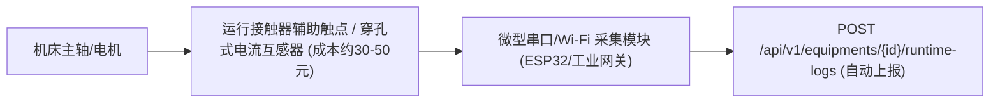

# MaintainWise 2.0 — 车间间歇运行设备运维实操管控标准指南 (SOP)

> **文档编号**：MW-SOP-DEV-001  
> **适用对象**：生产主管、车间主管工程师、班组长、当班维保技术员、设备操作员  
> **编制依据**：第一性原理驱动 · 零额外负担 · 伴随式采集 · 动态负荷预测 · 后来人闭环留痕  
> **适用场景**：非 7×24 小时连续运行、每天由技术员开机 2~8 小时不等、维护周期基于实际运转工时（如每 100/500 小时保养一次）的离散加工设备。

---

## 目录 (Table of Contents)

1. [第一章：业务背景与传统管理模式痛点剖析](#第一章业务背景与传统管理模式痛点剖析)
2. [第二章：间歇设备三大技术参数基准设定规范](#第二章间歇设备三大技术参数基准设定规范)
3. [第三章：技术员“伴随式”极简工时采集 SOP](#第三章技术员伴随式极简工时采集-sop)
4. [第四章：动态 14 天滑动加权负荷预测原理与解读](#第四章动态-14-天滑动加权负荷预测原理与解读)
5. [第五章：绿/黄/红分级预警机制与现场响应流程](#第五章绿黄红分级预警机制与现场响应流程)
6. [第六章：维保打卡结案与基准自动复位闭环](#第六章维保打卡结案与基准自动复位闭环)
7. [第七章：车间管理制度与防作弊留痕审计](#第七章车间管理制度与防作弊留痕审计)
8. [第八章：进阶硬件拓展：低成本 IoT 自动计时改造](#第八章进阶硬件拓展低成本-iot-自动计时改造)

---

## 第一章：业务背景与传统管理模式痛点剖析

在离散制造和现代工厂中，很多设备（如数控加工中心、折弯机、试验变压器、点焊机、切割机、备用空压机等）由当班技术员根据生产排产每天开机 2~8 小时不等，甚至有些设备数日不开机。

### 1.1 传统固定日历周期的两大恶果
1. **过度维保（Over-maintenance，虚耗成本）**：
   若设定“每月 1 号保养”，若某台设备当月产单较少仅开机 15 小时，强制停机更换高抗磨液压油、精密滤芯，纯属浪费企业生产成本与人工工时。
2. **欠维保与带病运转（Under-maintenance，酿成事故）**：
   若遇到排产旺季连续赶工，技术员每天开机 10 小时，仅半个月实际运转工时就超过了设计寿命上限（如 100 小时）。但由于“还没到月底”，机器在润滑脂变质、滤芯堵塞状态下严重超负荷带病运转，最终引发主轴磨损、电机烧毁甚至非计划停机停产。

### 1.2 第一性原理管控准则
对间歇运行设备，必须实行**基于实际运转工时的状态维保（Condition-Based Maintenance, CBM）**：
> **“工时不虚报、开机关机顺手记、动态预测到期日、临期邮件催备件、维保完成自动复位”**。

---

## 第二章：间歇设备三大技术参数基准设定规范

主管工程师在【设备信息】模块录入或编辑间歇设备时，必须在后台精准配置以下三大核心参数：

| 参数字段 | 字段类型 | 推荐配置值 | 业务含义与设定准则 |
| :--- | :---: | :---: | :--- |
| **运行模式 (`running_mode`)** | 枚举 | `INTERMITTENT` | 明确标识该机为间歇开启型，系统关闭自然日历倒计时，启用工时差额算法 |
| **维护周期小时 (`maintenance_interval_hours`)** | 浮点 | `100.0` ~ `500.0` | 设备供应商手册规定的单次保养安全运行时长（如每运行 100 小时更换一次润滑油脂） |
| **提前预警小时 (`advance_warning_hours`)** | 浮点 | `20.0` (默认) | 触发黄色临期预警的安全缓冲期。按日均开 5 小时折算，20 小时约提前 4 天通知，保证备件采购与生产排程窗口 |
| **维保基线工时 (`last_maintenance_hours`)** | 浮点 | 新机为 `0.0` | 记录上一次完成全面保养时的设备累计工时，用于计算当前周期的已消耗寿命 |

---

## 第三章：技术员“伴随式”极简工时采集 SOP

技术员在一线作业佩戴防尘手套，录入绝不能有任何繁琐操作。MaintainWise 2.0 提供了**三种伴随式采集途径**：

### 3.1 途径 A：下班/关机时极速录入（推荐模式）
* **操作时机**：技术员下班离开工位，或批次加工完成关机时。
* **操作动作**：
  1. 手机或车间工控机打开 MaintainWise，点击设备旁的【抄表】按钮（或扫描机身防水二维码）；
  2. 弹窗选择【模式一：填报今日增量工时】，输入今日开机时长（如：`6.5` 小时）；
  3. 点击【确定提交】，耗时 3 秒即可离开。
* **后台逻辑**：系统自动将 $6.5$ 小时累加到设备总工时 `total_running_hours`，并生成时序流水日志。

### 3.2 途径 B：根据物理表盘累计读数录入
* **操作时机**：机床、电箱外壳装有机械计时器、电能表或 PLC 运行累计小时表盘时。
* **操作动作**：
  1. 打开【抄表】弹窗，选择【模式二：填报表盘累计读数】；
  2. 直接输入物理表盘显示的数字（如：上次是 1200，今天表盘是 `1235`）；
  3. 点击提交，系统自动数学计算 $\Delta H = 1235 - 1200 = 35$ 小时，技术员无需心算。

### 3.3 途径 C：日常巡检打卡时顺手录入
* **操作时机**：技术员在进行设备点检或巡检打卡时。
* **操作动作**：打卡表单最下方提供【顺手记录今日运行工时（小时）】输入框，技术员勾选检查项合格后顺带填入小时数，打卡与工时一条龙提交，实现**“一次操作，双向闭环”**。

---

## 第四章：动态 14 天滑动加权负荷预测原理与解读

由于技术员每天开机 2~8 小时不等，固定日期无法反映真实的维保时间点。系统内置了 **14 天动态滑动加权预测引擎**：

### 4.1 数学模型
系统自动聚合该设备在最近 14 天内的所有抄表增量流水 $\Delta H_i$，采用**“越靠近今天权重越高”**的线性加权权重 $w_i = i$：

$$T_{\text{avg}} = \frac{\sum_{i=1}^{14} i \cdot \Delta H_i}{\sum_{i=1}^{14} i}$$

根据当前剩余工时与 $T_{\text{avg}}$，实时推导预计剩余自然日：

$$\text{剩余可用工时} = \text{maintenance\_interval\_hours} - (\text{total\_running\_hours} - \text{last\_maintenance\_hours})$$

$$\text{预计剩余自然天数} = \left\lceil \frac{\text{剩余可用工时}}{\max(T_{\text{avg}}, 0.5)} \right\rceil$$

### 4.2 业务效果实例对比
以周期为 100 小时、已消耗 80 小时（剩余 20 小时）的机床为例：
* **场景一：旺季赶工（最近几天技术员每天开 8 小时）**：
  $T_{\text{avg}} \approx 7.5$ 小时/天 $\Rightarrow$ 预计剩余天数 $= \lceil 20 / 7.5 \rceil = \mathbf{3 \text{ 天}}$。系统提示：紧迫度高，需立即准备滤芯。
* **场景二：淡季停机（最近一周每天仅调试开机 1 小时）**：
  $T_{\text{avg}} \approx 1.0$ 小时/天 $\Rightarrow$ 预计剩余天数 $= \lceil 20 / 1.0 \rceil = \mathbf{20 \text{ 天}}$。系统提示：设备负荷轻，无需紧急停机。

---

## 第五章：绿/黄/红分级预警机制与现场响应流程

系统根据剩余工时与预警阈值的关系，实施**三色自适应分级管控**：

### 5.1 现场行动矩阵
| 状态等级 | 触发判据 | 系统响应行为 | 技术员现场动作 | 主管工程师动作 |
| :--- | :--- | :--- | :--- | :--- |
| **🟢 绿色健康** | 剩余工时 $> 20$h | 设备列表与大盘进度条为绿色，展示“剩余 XX 小时” | 正常开机作业，班末如实填报增量工时 | 日常巡查，关注负荷走势 |
| **🟡 黄色临期** | 剩余工时 $\le 20$h | 1. 列表亮起【即将到期】黄色勋章； 2. 系统自动向指定邮箱发送告警邮件； 3. 大盘看板汇入待办泳道 | 检查油位油色；提醒班组长未来 2~3 天有维保需求 | 核实备件库（黄油、密封圈、滤芯）；在工作计划中排定维保窗口 |
| **🔴 红色逾期** | 剩余工时 $\le 0$h | 1. 列表高亮爆红【已逾期 XX 小时】； 2. 工作台待办清单置顶强警示 | 除非紧急订单，应向工程师报告并申请停机保养 | 下达强制维保单，指派技术员现场执行全项 SOP 检修 |

---

## 第六章：维保打卡结案与基准自动复位闭环

当设备到达维护阈值时，技术员与工程师按以下标准步骤完成闭环：

1. **现场标准作业**：技术员持工单或前往设备台前，按照 SOP 逐项执行清洁、换油、紧固与电气绝缘测试；
2. **打卡勾选**：打开【设备维护】打卡界面，逐项标记【合格】（如有隐患标记异常自动联锁派发维修单）；
3. **基准自动归零复位（核心技术闭环）**：
   - 打卡提交成功瞬间，底层事务执行原子更新：
     $$\text{last\_maintenance\_hours} = \text{total\_running\_hours}$$
   - 剩余倒计时工时重新回到满格（如 100 小时）；
   - 设备状态重返 🟢 绿色健康态，开启下一轮运行周期。

---

## 第七章：车间管理制度与防作弊留痕审计

任何管理工具都需要制度保证真实性，杜绝技术员“漏报、瞎报、一拍脑袋乱编”：

1. **一机一码一责任人挂牌制**：
   每台设备机身必须张贴由系统自动生成的防油污二维码标牌，清晰印刷责任技术员与主管工程师工号。
2. **后来人终身维修病历全流程留痕（防推诿扯皮）**：
   系统【终身维修病历时间轴】不仅记录工时数值，还精确记录了操作人工号、提交时间戳与 IP 地址。如果设备因漏保引发主轴抱死，调阅病历时间轴即可查明是哪位技术员在何日未如实抄表，责任边界清晰明确。
3. **主管工程师每周双盲抽查制**：
   主管工程师每周在车间随机抽验 3~5 台设备的物理电表/计时器读数，与系统内的 `total_running_hours` 对比，允许误差 $\le 5\%$。对连续 30 天准确记录的当班技术员给予星级绩效加分。

---

## 第八章：进阶硬件拓展：低成本 IoT 自动计时改造

如果车间希望彻底解放技术员、杜绝人工抄表漏记，可在设备端进行轻量级低成本改造：

* **改造方案**：
  在控制柜的主接触器辅助触点上并联微型脉冲传感器，或在主供电线上穿入穿孔式电流互感器；
* **联动逻辑**：
  电机通电运转时电流大于阈值，传感器闭合，硬件模块每运转 1 小时向 MaintainWise API 自动推送一次 `delta_hours = 1.0`；停机时停止推送。
* **收益**：100% 免人工干预，精度精确到分钟级，真正实现**“无人化智能在线维保”**。
