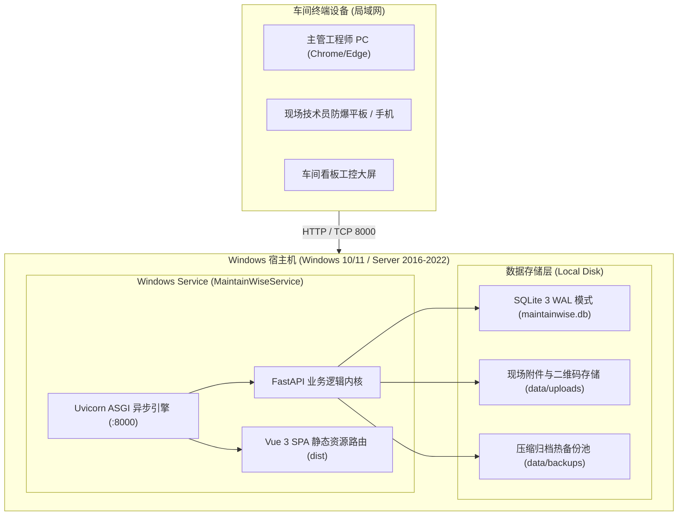

# MaintainWise 2.0 智能工厂设备管理系统 - Windows 生产部署与运维实战指南

> **版本**：MaintainWise V2.0 Enterprise  
> **适用操作系统**：Windows 10 / Windows 11 (64-bit)、Windows Server 2012 R2 / 2016 / 2019 / 2022 (64-bit)  
> **适用人员**：工厂 IT 工程师、车间电气自动化工程师、系统运维管理人员

---

## 目录
1. [系统架构与部署优势](#一系统架构与部署优势)
2. [环境准备与系统要求](#二环境准备与系统要求)
3. [目录结构与部署脚本清单](#三目录结构与部署脚本清单)
4. [方式一：全自动一键部署向导（推荐，30秒极速上线）](#四方式一全自动一键部署向导推荐30秒极速上线)
5. [方式二：分步初始化与前台测试运行](#五方式二分步初始化与前台测试运行)
6. [方式三：部署为 Windows 后台自启守护服务（生产推荐）](#六方式三部署为-windows-后台自启守护服务生产推荐)
7. [车间局域网与移动终端（平板/手机）访问配置](#七车间局域网与移动终端平板手机访问配置)
8. [预设账号与密码安全策略说明](#八预设账号与密码安全策略说明)
9. [企业高可用数据热备份与灾备恢复指南](#九企业高可用数据热备份与灾备恢复指南)
10. [端口修改与离线部署方案](#十端口修改与离线部署方案)
11. [常见问题排查（FAQ）](#十一常见问题排查faq)

---

## 一、系统架构与部署优势

MaintainWise 2.0 专为工业制造车间现场设计，具备极致轻量、高可靠与零维护负担的工程特点：

* **单端口全栈服务（Single-Port Full-Stack）**  
  编译后的 Vue 3 现代前端单页应用（SPA）已由后端 FastAPI 高性能内核在根路由统一托管。**在 Windows 服务器上无需安装 Node.js、npm、Nginx 或 Apache 反向代理**，单一进程监听 `8000` 端口即可同时承载 Web 页面与 RESTful API。
* **零 C++ 编译环境依赖（Zero Native Compilation）**  
  全栈核心与扩展依赖均为纯 Python 轮子（Pre-compiled Wheels），部署过程中**无需安装 Visual Studio、C++ Build Tools 或复杂 SDK**。
* **高并发嵌入式 SQLite 3 WAL 引擎**  
  系统数据集中保存在 `data/maintainwise.db`。采用 SQLite 预写日志模式（Write-Ahead Logging），支持车间多端并发读写，无需额外安装和维护 MySQL、SQL Server 或 PostgreSQL 数据库服务。
* **工业级无感热备份**  
  内置 SQLite 在线纯内存备份 API，备份过程中不影响车间现场任何打卡与工单操作，一键打包数据库与全部图纸、二维码资产。



---

## 二、环境准备与系统要求

### 2.1 硬件与系统规格建议

| 指标 | 最低要求 | 推荐配置（生产环境） |
| :--- | :--- | :--- |
| **操作系统** | Windows 10 (64-bit) / Server 2012 R2 | Windows Server 2019/2022 (64-bit) 或 Windows 11 专业版 |
| **CPU** | 1 核 2.0 GHz | 4 核 2.5 GHz 以上 |
| **内存** | 1 GB RAM | 4 GB RAM 以上 |
| **磁盘空间** | 500 MB 可用空间 | 20 GB 以上（视现场照片与备份保留周期而定） |
| **网络** | 具备百兆网卡，内网连通 | 千兆有线局域网，车间覆盖 5G Wi-Fi |

### 2.2 必备运行时：Python 3.10+ 安装

在部署前，宿主机仅需安装一个基础环境：**Python 3.10 / 3.11 / 3.12（64位）**。

> [!IMPORTANT]
> **Python 安装关键避坑步骤（务必注意）：**
> 1. 前往 Python 官网下载安装包：[https://www.python.org/downloads/windows/](https://www.python.org/downloads/windows/)（推荐下载 Python 3.11 或 3.12 的 `Windows installer (64-bit)`）。
> 2. 双击安装程序时，在弹出的第一屏底部，**务必勾选「Add python.exe to PATH」**（将 Python 添加到系统环境变量）。
> 3. 点击「Customize installation」，建议将安装路径更改为短路径（如 `C:\Python312`），避免带中文或特殊字符的目录。
> 4. 安装完成后，在安装完成界面点击「Disable path length limit」（解除 Windows 260 字符路径长度限制）。

#### 验证 Python 是否安装成功
按下键盘快捷键 `Win + R`，输入 `cmd` 回车，在黑色命令行窗口中执行：
```bat
python --version
pip --version
```
若正常显示例如 `Python 3.12.3` 和 `pip 24.x`，说明 Python 环境配置成功。

---

## 三、目录结构与部署脚本清单

将 MaintainWise 2.0 系统源码或发布包解压至目标磁盘（例如 `D:\MaintainWise_V2` 或 `C:\MaintainWise_V2`）。目录结构如下：

```text
MaintainWise_V2/
├── maintainwise.bat                 <-- [根目录统一总控入口] 双击弹出交互式运维菜单，亦支持参数指令
├── mw.bat                           <-- [根目录极简别名] 快捷批处理入口
├── .gitattributes                   <-- [跨平台换行符守护] 锁定 *.bat 为 CRLF，杜绝跨平台字符截断错位
├── deploy/
│   └── windows/                     <-- Windows 专用运维脚本套件
│       ├── 0_deploy_all.bat         <-- 交互式全自动部署向导
│       ├── 1_init_env.bat           <-- 环境与 Python 依赖安装、数据库初始化
│       ├── 2_start_foreground.bat   <-- 前台交互式测试运行
│       ├── 3_install_service.bat    <-- 安装为 Windows 后台常驻自启服务
│       ├── 4_start_service.bat      <-- 启动 Windows 后台服务
│       ├── 5_stop_service.bat       <-- 停止 Windows 后台服务
│       ├── 6_uninstall_service.bat  <-- 卸载 Windows 后台服务
│       ├── 7_backup_now.bat         <-- 手动执行在线全量热备份
│       ├── winsw.xml                <-- Windows 服务守护器参数配置文件
│       └── README_WINDOWS.txt       <-- Windows 纯文本速查手册
├── backend/                         <-- FastAPI 业务后端与数据库引擎
├── frontend/dist/                   <-- 编译完成的 Vue 3 高性能静态资源
├── data/                            <-- 数据存放目录
│   ├── maintainwise.db              <-- SQLite 主数据库文件（初始化时自动生成）
│   ├── backups/                     <-- 系统热备份 ZIP 归档库
│   └── uploads/                     <-- 现场报修照片、二维码存储区
└── docs/                            <-- 详细设计与部署文档
```

---

## 四、方式一：全自动一键部署向导（推荐，30秒极速上线）

这是最推荐的使用方式，适合初次安装或小白用户。

### 操作步骤：
1. 打开 `MaintainWise_V2` 根目录。
2. **直接双击运行 `maintainwise.bat`**（或在命令行输入 `maintainwise.bat deploy` 或 `.\mw.bat`）。
3. 界面将弹出友好总控菜单：
   ```text
   =======================================================================
          MaintainWise 2.0 - Windows 命令行与交互总控入口
   =======================================================================
   可选指令 (Commands):
     [1] deploy   一键全自动依赖安装与环境初始化向导
     [2] test     前台交互测试启动 (推荐初次运行/实时查看日志)
     [3] start    启动 Windows 后台自启系统服务 (net start)
     [4] stop     停止 Windows 后台系统服务 (net stop)
     [5] restart  重启 Windows 后台系统服务
     [6] status   查看 Windows 服务运行状态与端口监听
     [7] backup   立即执行一次 SQLite WAL 全量热备份
     [0] exit     退出
   =======================================================================
   ```
4. 输入 `1` 并回车，向导将全自动依序执行：
   * **检测 Python**：校验系统当前 Python 与 pip 是否就绪；
   * **依赖安装**：自动使用清华大学国内 PyPI 镜像源下载安装 FastAPI、Uvicorn、Pillow、QRcode 等所需库；
   * **数据库初始化**：自动创建 SQLite 数据库、初始化用户表、设备表、预设 SOP 巡检标准及初始账号；
5. 部署完成后，在菜单输入 `2`（或执行 `maintainwise.bat test`），即可在前台启动服务；在浏览器输入 `http://127.0.0.1:8000` 即可登录并使用！

---

## 五、方式二：分步初始化与前台测试运行

适合需要逐步排查网络依赖、调试接口或临时在个人笔记本上进行功能演示的场景。

### 步骤 1：执行环境与数据库初始化
进入目录 `deploy\windows\`，双击运行：
```bat
1_init_env.bat
```
* 脚本会自动检查 `backend\requirements.txt`；
* 通过国内源下载缺失依赖；
* 运行 Python 脚本完成数据库建表与种子数据填充；
* 窗口显示 `[OK] Database and demo data initialized successfully!` 后提示按任意键继续。

### 步骤 2：启动前台控制台服务
在 `deploy\windows\` 目录下，双击运行：
```bat
2_start_foreground.bat
```
* 系统将在当前黑底控制台窗口启动 Uvicorn ASGI 服务，监听 `0.0.0.0:8000`。
* 打开本地浏览器（推荐 Chrome、Edge），访问：
  ```
  http://127.0.0.1:8000
  ```
* **退出方法**：在前台命令行窗口中按下 `Ctrl + C`，服务将平滑关闭。

---

## 六、方式三：部署为 Windows 后台自启守护服务（生产推荐）

在工厂数字化车间服务器上，要求**服务器重启后无人登录桌面，系统仍能自动在后台启动运行**。本系统通过工业界广泛使用的轻量化服务包装器 **WinSW (Windows Service Wrapper)** 实现标准 Windows Service 守护。

### 守护服务特性：
* **开机自启**：系统启动即常驻后台，不依赖任何用户登录 Windows 桌面；
* **崩溃自愈**：若进程由于系统异常退出，Windows 服务守护器将在 **10 秒内自动重新拉起**；
* **日志轮转（Log Rotation）**：运行日志存放在 `deploy\windows\logs\`，单文件达到 10MB 自动轮转归档，最多保留 10 份，杜绝跑满磁盘。

### 详细安装步骤：

#### 1. 以管理员权限打开脚本
* 进入 `deploy\windows\` 目录；
* 找到 **`3_install_service.bat`**；
* **鼠标右键单击**，选择「**以管理员身份运行**」（Run as Administrator）。

> [!NOTE]
> 脚本具备自动检测与下载能力：
> * 若当前目录不存在 `MaintainWiseService.exe`，脚本会尝试通过系统内置 PowerShell 自动下载官方适配版本；
> * 若为完全离线的内网服务器，可提前从 [WinSW Releases](https://github.com/winsw/winsw/releases) 下载 `WinSW-x64.exe`，重命名为 `MaintainWiseService.exe` 并放置于 `deploy\windows\` 目录下即可。

#### 2. 启动服务
双击运行：
```bat
4_start_service.bat
```
命令行提示：
```text
Starting MaintainWiseService...
MaintainWise 2.0 Factory Maintenance Service 服务正在启动 .
MaintainWise 2.0 Factory Maintenance Service 服务已经启动成功。
```

#### 3. 验证 Windows 服务状态
按下 `Win + R`，输入 `services.msc` 回车打开「服务」管理窗口。找到名称为：
```
MaintainWise 2.0 Factory Maintenance Service (内部名: MaintainWiseService)
```
其「启动类型」已配置为 **自动**，「状态」为 **正在运行**。

#### 4. 服务的日常运维管理
在 `deploy\windows\` 目录下已备齐配套控制脚本：
* **停止服务**：双击 `5_stop_service.bat`（或在 `services.msc` 点击停止）。
* **卸载服务**：右键以管理员身份运行 `6_uninstall_service.bat`（清理系统服务注册项）。
* **查看运行日志**：打开 `deploy\windows\logs\MaintainWiseService.out.log` 和 `MaintainWiseService.err.log`。

---

## 七、车间局域网与移动终端（平板/手机）访问配置

在实际工厂车间中，现场巡检技术员使用三防平板、PDA 或智能手机扫描设备二维码打卡，主管工程师在办公室内通过内网电脑访问。需要确保 Windows 宿主机的网络与防火墙设置正确。

### 7.1 查看服务器内网 IP 地址
1. 在 Windows 服务器上按下快捷键 `Win + R`，输入 `cmd` 并回车；
2. 输入 `ipconfig` 命令，找到当前连接的局域网网卡（例如「以太网」或「WLAN」）；
3. 记录对应的 **IPv4 地址**（例如 `192.168.1.108` 或 `10.10.20.15`）。

### 7.2 配置 Windows Defender 防火墙放行 8000 端口

Windows 系统默认会拦截外部设备访问 8000 端口。需添加一条入站放行规则。

#### 快捷方法：使用 PowerShell 一行命令搞定（最推荐）
1. 按下 `Win + X` 键，选择「Windows PowerShell (管理员)」或「终端 (管理员)」；
2. 复制并执行以下命令：
```powershell
New-NetFirewallRule -DisplayName "MaintainWise 2.0 Factory Service" -Direction Inbound -Protocol TCP -LocalPort 8000 -Action Allow
```
终端输出 `Enabled: True` 即代表防火墙规则已立即生效。

#### 图形界面手动配置方法（备选）
1. 打开「控制面板」->「系统和安全」->「Windows Defender 防火墙」；
2. 点击左侧导航栏的「**高级设置**」；
3. 选择「**入站规则**」-> 点击右侧栏的「**新建规则...**」；
4. 规则类型选择「**端口**」，点击下一步；
5. 选择「**TCP**」，在「特定本地端口」中填入：`8000`，点击下一步；
6. 选择「**允许连接**」，点击下一步；
7. 配置文件勾选「域」、「专用」、「公用」，点击下一步；
8. 名称填写：`MaintainWise 2.0`，点击完成。

### 7.3 终端访问验证
* **主管工程师电脑（办公室局域网）**：在浏览器打开 `http://192.168.1.108:8000`。
* **现场技术员平板/手机（车间 Wi-Fi）**：连接同一车间无线网络，在手机浏览器中输入 `http://192.168.1.108:8000`，即可进行扫码打卡与工单处理。

---

## 八、预设账号与密码安全策略说明

### 8.1 初始预设账号（三级角色 RBAC）

系统内置三级工业标准角色账号，所有初始账号密码统一为：**`password123`**。

| 登录账号 | 角色定位 | 典型职责与权限 |
| :--- | :--- | :--- |
| **`admin`** | **系统管理员 (ADMIN)** | 全局系统定制、SMTP 邮件服务配置、全量热备份、用户录入、账号解冻与权限分配 |
| **`engineer1`** | **主管工程师 (ENGINEER)** | 设备台账管理、零前置建树、突发工单调度指派、完工闭环验收、典型案例沉淀为知识库 |
| **`tech1`** | **现场技术员 (TECHNICIAN)** | 设备巡检维护打卡（动态 SOP 核验）、工时流水填报、突发故障 30 秒极速报修与抢修回填 |

### 8.2 企业等保密码安全防护机制
根据工业信息安全规范，MaintainWise 2.0 已内置企业级密码安全策略：
1. **首次登录强制改密**：新录入员工首次使用初始密码登录时，系统将强制锁定弹出「首次登录必须修改密码」对话框，成功修改前禁止进入任何业务菜单。
2. **180 天有效期自动防护**：
   * 密码有效期为 **180 天**；
   * 密码到期前 **3 天**，系统顶部将常驻醒目黄色安全预警条，并自动发送邮件提醒员工尽快更换密码；
   * 超过 180 天未更换密码，系统将**自动锁定冻结该账号**，拒绝登录。
3. **管理员解冻通道**：若员工账号超期冻结，管理员可在【用户管理】界面中核验员工身份并点击 `[🔓 解冻]` 按钮，解冻后员工登录时需重新设置新密码。

---

## 九、企业高可用数据热备份与灾备恢复指南

MaintainWise 2.0 采用纯内存零锁备份技术，备份过程中不会导致车间前台卡顿或断流。

### 9.1 手动一键热备份
在需要进行版本升级、系统迁移或重大调整前，可执行手动备份：
* **方式 A（脚本备份）**：双击运行 `deploy\windows\7_backup_now.bat`。
* **方式 B（系统界面备份）**：管理员登录系统，进入【系统设置】-> 点击「**⚡ 立即执行全量热备份**」按钮。

系统会在 `data\backups\` 目录下生成形如 `maintainwise_backup_20260916_083000.zip` 的压缩文件。备份包内完整收录：
* 当前 SQLite 数据库文件（`maintainwise.db`）；
* 全厂设备二维码与现场报修图纸资产（`data\uploads\`）。

### 9.2 配置 Windows 任务计划程序实现每日自动定时备份

通过 Windows 内置的「任务计划程序（Task Scheduler）」，可以实现每晚无人值守全自动归档。

#### 配置步骤：
1. 按下 `Win + R`，输入 `taskschd.msc` 回车打开任务计划程序；
2. 在右侧面板点击「**创建基本任务...**」；
3. 任务名称填写：`MaintainWise_Daily_Backup`，点击下一步；
4. 触发器选择「**每天**」，点击下一步；
5. 开始时间设定为夜间业务低峰期（例如：`02:00:00`），点击下一步；
6. 操作选择「**启动程序**」，点击下一步；
7. **关键配置**：
   * **程序或脚本**：浏览选择 `deploy\windows\7_backup_now.bat` 的绝对路径（如 `D:\MaintainWise_V2\deploy\windows\7_backup_now.bat`）；
   * **起始于 (可选)**：填入批处理所在目录（如 `D:\MaintainWise_V2\deploy\windows`）；
8. 点击下一步，勾选「当单击完成时，打开此任务属性的对话框」，点击完成；
9. 在弹出的属性对话框中，勾选「**不管用户是否登录都要运行**」和「**使用最高权限运行**」，点击确定即可。

### 9.3 灾备恢复步骤（从备份还原）
若遭遇服务器硬件故障或需要迁移到新服务器，恢复仅需 3 步：
1. **停止服务**：双击运行 `5_stop_service.bat` 确保进程退出；
2. **解压替换**：解压最新的 `data\backups\maintainwise_backup_*.zip` 备份包，将其中的 `maintainwise.db` 与 `uploads` 文件夹覆盖至目标环境的 `data\` 目录下；
3. **重新启动**：双击运行 `4_start_service.bat`，系统立即可用，历史单据与数据完整如初。

---

## 十、端口修改与离线部署方案

### 10.1 修改默认服务端口（从 8000 改为其他端口）
若宿主机的 `8000` 端口已被其他业务占用（例如被 ERP 或 OA 系统占用），需调整为如 `9000`：

1. **修改前台测试脚本**：打开 `deploy\windows\2_start_foreground.bat`，将 `--port 8000` 改为 `--port 9000`；
2. **修改 Windows 服务配置**：使用文本编辑器打开 `deploy\windows\winsw.xml`，定位到第 6 行：
   ```xml
   <arguments>-m uvicorn app.main:app --host 0.0.0.0 --port 9000 --app-dir backend</arguments>
   ```
   将 `8000` 修改为 `9000` 保存；
3. 若服务已安装，需以管理员身份运行 `6_uninstall_service.bat` 后，再运行 `3_install_service.bat` 和 `4_start_service.bat` 重新载入配置。

### 10.2 纯离线局域网环境（无外网连接）部署方案

若工厂车间服务器处于严禁外网访问的保密工业内网，可通过以下「外网准备、内网拷入」的方式部署：

#### 阶段 1：在外网有网络的 Windows 电脑上下载离线 Wheel 包
在一台已连接外网的相同架构 Windows 电脑上，执行命令：
```bat
cd MaintainWise_V2\backend
pip download -r requirements.txt -d .\wheels_cache -i https://pypi.tuna.tsinghua.edu.cn/simple
```
同时从 GitHub 下载好 `WinSW-x64.exe`，重命名为 `MaintainWiseService.exe` 放入 `deploy\windows\`。

#### 阶段 2：通过 U 盘拷贝至内网 Windows 服务器并安装
将整个工程及 `wheels_cache` 目录拷贝至内网服务器，在内网服务器打开命令行执行：
```bat
cd MaintainWise_V2\backend
pip install --no-index --find-links=.\wheels_cache -r requirements.txt
```
安装完成后，直接双击 `maintainwise.bat`（选 `1` 部署）或 `3_install_service.bat` 即可离线完成安装。

---

## 十一、常见问题排查（FAQ）

### Q1：双击运行脚本时，提示 `'python' 不是内部或外部命令，也不是可运行的程序`？
* **原因**：安装 Python 时未勾选「Add python.exe to PATH」，系统找不到 Python 可执行文件。
* **解决办法**：
  1. 重新运行 Python 安装包，点击「Modify」->「Next」，勾选「Add Python to environment variables」；
  2. 或在 Windows「高级系统设置」->「环境变量」的 `Path` 中手动添加 Python 安装目录（如 `C:\Python312` 及 `C:\Python312\Scripts`）。配置后需重新打开命令行生效。

### Q2：运行 `1_init_env.bat` 下载依赖时网络连接超时或报错？
* **解决办法**：国内部分企业内网可能对清华源有限制，可手动打开命令行尝试切换为阿里云或腾讯云镜像：
  ```bat
  pip install -r backend\requirements.txt -i https://mirrors.aliyun.com/pypi/simple/
  ```

### Q3：运行 `3_install_service.bat` 提示 `Access is denied`（拒绝访问）？
* **原因**：注册 Windows 系统服务需要操作系统管理员权限。
* **解决办法**：不要直接双击，必须**鼠标右键**点击 `3_install_service.bat`，选择「**以管理员身份运行**」。

### Q4：服务器本机可以访问，但车间其他电脑或手机提示「无法访问此网站」？
* **排查顺序**：
  1. 检查访问地址是否误填成了 `127.0.0.1`（外部设备必须使用服务器的真实内网 IP，如 `192.168.1.108:8000`）；
  2. 确认手机/平板与服务器处于同一 Wi-Fi 或局域网网段，在手机终端上是否能 ping 通服务器 IP；
  3. 确认 Windows 防火墙已按照 [第七节](#七车间局域网与移动终端平板手机访问配置) 放行了 TCP `8000` 端口入站规则。

### Q5：如何确认 Windows 后台守护服务的运行状况？
* 打开 `deploy\windows\logs\` 目录，查阅 `MaintainWiseService.out.log`（标准运行日志）与 `MaintainWiseService.err.log`（错误日志）；
* 若日志显示 `Uvicorn running on http://0.0.0.0:8000 (Press CTRL+C to quit)`，即代表服务运行完全正常。

### Q6：在 Windows 终端运行批处理时，提示 `'l' is not recognized`、`'cho'`、`The service name is invalid` 字符错位或命令跳穿？
* **原因**：跨平台（如通过 Mac/Linux 共享目录、虚拟机挂载或未配置换行符的 Git 拷贝）检出批处理文件时，文件换行符变成了 Unix 风格的 `\n` (LF)。Windows 的 `cmd.exe` 在解析 `goto` 跳转与按行执行时强依赖 `\r\n` (CRLF，2 字节)，单字节 LF 会导致 `cmd.exe` 指针逐行向前累计错位 1~2 个字节，从而截断命令（如 `call` 变 `'l'`、`echo` 变 `'cho'`、`pause` 变 `'se'`）并意外跳穿至 `start` / `stop` 标签。
* **解决办法**：
  1. **Git 官方防护**：项目根目录已内置 `.gitattributes`，声明 `*.bat text eol=crlf`。只要通过 Git 拉取代码，Git 会自动保障批处理文件采用 CRLF；
  2. **终端一键自修复**：若从共享文件夹直接拷贝，可在 Windows PowerShell 窗口中直接执行以下一行修复指令：
     ```powershell
     Get-ChildItem -Path . -Filter *.bat -Recurse | ForEach-Object { (Get-Content $_.FullName -Raw) -replace "(?<!`r)`n", "`r`n" | Set-Content $_.FullName -NoNewline }
     ```
  3. 修复换行符后，运行 `.\maintainwise.bat deploy` 即可顺利初始化。

### Q7：在 Windows (尤其是 ARM64 或 Python 3.13) 安装依赖时提示 `Building wheel for cryptography ... error: linker link.exe not found`？
* **原因**：老版本依赖声明了 `python-jose[cryptography]`，而底层的 `cryptography` 是 C/Rust 编写的重型库。在 Windows ARM64（如 Mac 虚拟机）或极新 Python 版本下无官方预编译二进制轮子，导致 pip 尝试调用 MSVC `link.exe` 现场编译，因未安装 Visual Studio C++ 工具而报错。
* **解决办法**：
  1. MaintainWise 2.0 仅需标准 JWT 对称加密（HS256），底层已彻底平滑升级为现代轻量级纯 Python 依赖 **`pyjwt`**（零编译、仅 32 KB，在任何平台均免编译秒级安装）；
  2. 若本地拷贝的代码依赖清单滞后，可在 PowerShell 窗口执行一行自动替换：
     ```powershell
     (Get-Content backend\requirements.txt) -replace "python-jose\[cryptography\].*", "pyjwt>=2.8.0" | Set-Content backend\requirements.txt
     ```
  3. 然后重新运行 `.\maintainwise.bat deploy` 即可秒装通过。

### Q8：运行批处理脚本时弹出系统警告 `Windows cannot find 'Background'. Make sure you typed the name correctly...`？
* **原因**：Windows 批处理中 `&` 符号是内置的命令连接符（类似于 Linux 的 `;`）。若在 `echo` 提示文本中使用了双引号外的 `Install & Start Background`，系统会把前半句作为打印，后半句当作执行系统的 `start` 命令，尝试启动名为 `Background.exe` 的程序，从而引发 Windows 系统弹窗报警。
* **解决办法**：
  1. 最新脚本中所有提示文本已将 `&` 全面替换为纯文字 `and`（如 `Install and Start`）；
  2. 若本地文件尚未同步，可在 PowerShell 中执行一行替换：
     ```powershell
     (Get-Content deploy\windows\0_deploy_all.bat) -replace "Install & Start", "Install and Start" | Set-Content deploy\windows\0_deploy_all.bat
     ```
  3. 亦可直接在弹出的菜单中输入 `1`（前台测试）或执行 `.\maintainwise.bat test` 直接启动。

---

> **技术支持与维护团队**：MaintainWise 智能工厂软件研发小组  
> 如有二次定制或现场设备接口对接需求，请参阅 `docs/` 目录下的系统设计规范与接口说明文档。
